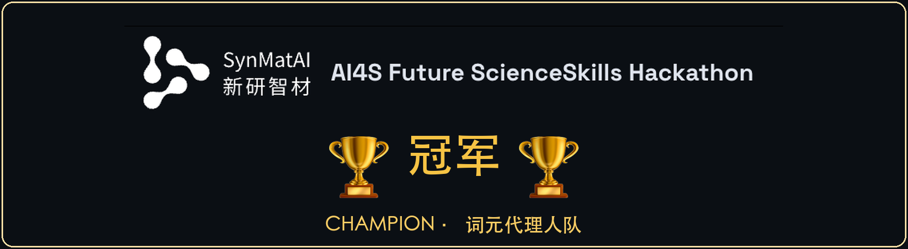
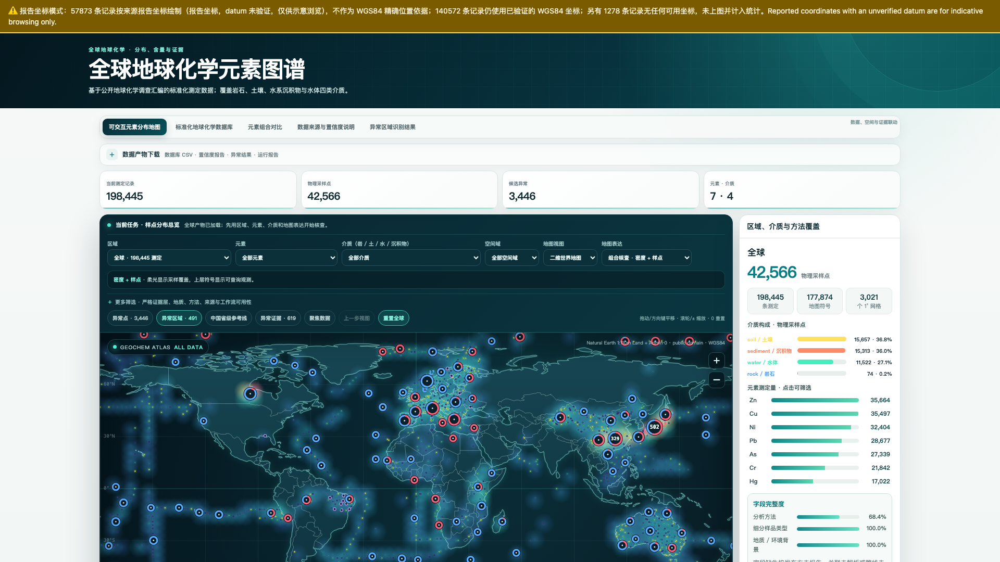
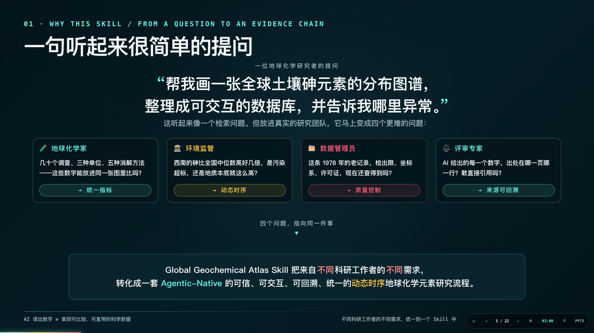
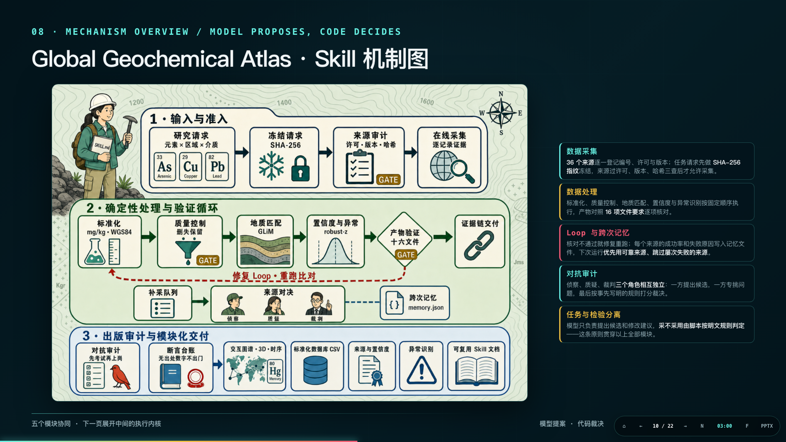
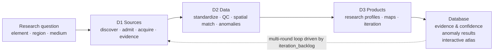
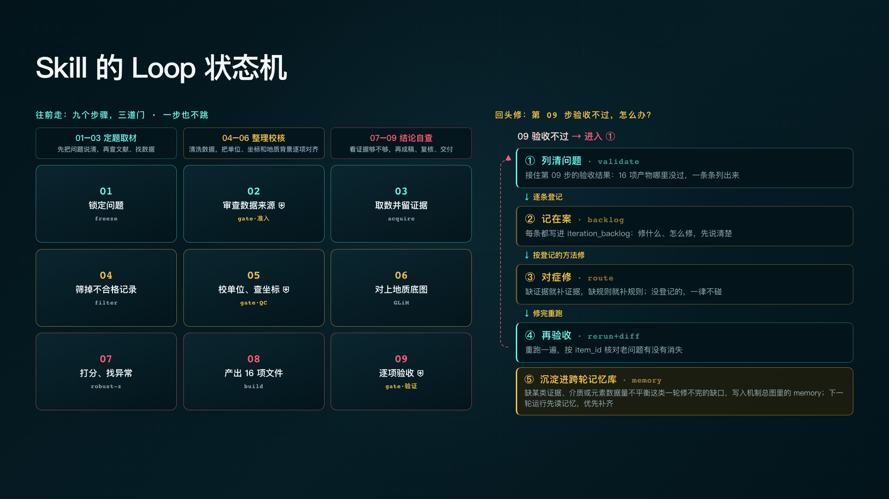
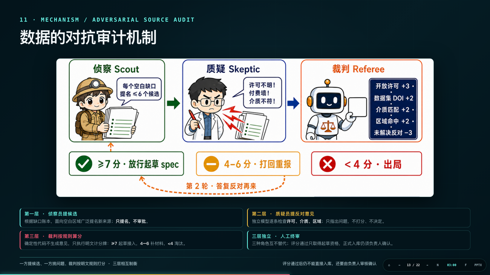
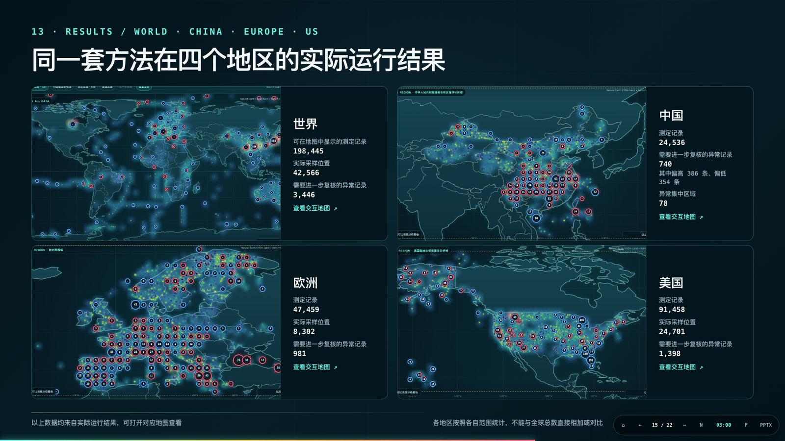
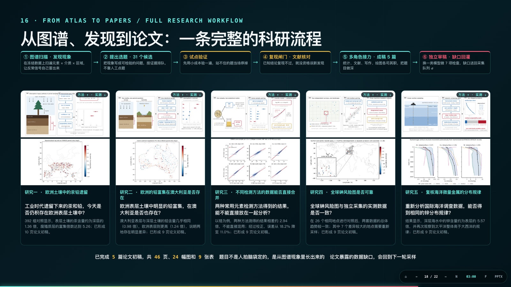
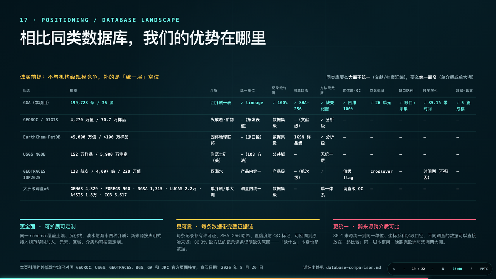

<div align="center">

# 🌍 Global Geochemical Atlas Skill

**A reusable research skill for AI agents — turn scattered public geochemistry into a traceable database, screened anomaly candidates, and self-contained interactive atlases.**

**English** | [简体中文](README.zh-CN.md)

[](https://github.com/asimfish/global-geochemical-atlas-skill/actions/workflows/ci.yml)
[](#-quick-start-90-seconds)
[](#-quick-start-90-seconds)
[](#-development--testing)
[](#-use-it-with-your-ai-agent)
[](#-awards--media)
[](LICENSE)

[🌐 Project Site](https://asimfish.github.io/global-geochemical-atlas-demo/) ·
[🗺️ Live Atlas](https://asimfish.github.io/global-geochemical-atlas-demo/live/world-atlas.html) ·
[🎬 Demo Video](https://asimfish.github.io/global-geochemical-atlas-demo/finals/Global-Geochemical-Atlas-Final-Demo.mp4) ·
[🧪 Team Site](https://chembot.zgca.com/)

[🚀 Quick Start](#-quick-start-90-seconds) ·
[🤖 Use with Your Agent](#-use-it-with-your-ai-agent) ·
[🏗️ How It Works](#️-how-it-works) ·
[🧭 Data Sources](#-data-sources-22-frozen-sources) ·
[📦 Outputs](#-the-16-output-files) ·
[❓ FAQ](#-faq)

<a href="https://synmatai.cn/hackathon/"></a>



<sub>Interface capture from the 2026-08-19 global online production run: <b>199,730</b> measurements admitted to the database · <b>45,753</b> distinct physical samples · <b>35</b> public sources · <b>3,721</b> anomaly screening candidates (robust-z candidates, not genetic conclusions). Blank areas honestly show data gaps. <b><a href="https://asimfish.github.io/global-geochemical-atlas-demo/">Live demo ↗</a></b></sub>

<br><br>


<sub>One self-contained HTML file ships both a 2D world map and a draggable 3D globe — no CDN, no server, fully interactive offline.</sub>

</div>

---

## 📌 What Is This

A complete, agent-native **research skill** — not a pre-rendered map. Given an *element × region × medium* request, an AI agent follows the **D1 → D2 → D3** workflow to discover and freeze public data sources, run unit and coordinate quality control, screen enrichment/depletion candidates within comparable background groups, and deliver an auditable standardized database, evidence reports, and interactive atlases.

**Capabilities at a glance** — automatically collects element concentrations, sampling coordinates, geological background, and analytical-method metadata from public literature and open data platforms across four media (rock, soil, sediment, water); performs unit unification, spatial matching, quality control, and provenance tracing; renders global or regional distribution maps, heatmaps, and element-combination comparisons filterable by element, region, geological unit, and sample type; and identifies both enrichment and depletion anomaly candidates.

| Your question | What it guarantees |
|---|---|
| Where does the data come from? | 22 frozen public sources (rock / soil / sediment / water), every record bound to a DOI, version, license, and file SHA-256 |
| Can I trust the numbers? | Original values are never overwritten, censored values are never imputed, batch QC is recomputed per record, and a five-component confidence score comes with an explicit "this is not a probability of correctness" disclaimer |
| Dare I cite the conclusions? | Anomalies are reported strictly as screening candidates with competing explanations listed; scopes that could not be completed are reported as gaps — never dressed up as full coverage |
| Can I reuse it elsewhere? | 40+ JSON Schemas, a 16-file output contract, self-contained HTML maps, and pure-stdlib scripts that work outside this repository |

Latest global online production run (2026-08-19, fully autonomous): **199,730** deterministically admitted records · **45,753** distinct physical samples · **35** connected public sources (31 further candidates audited and rejected) · **100%** record-level provenance chains · **3,721** anomaly screening candidates · **393** records that failed the standardization gate kept honestly in place — never silently dropped. Structured run evidence with a guided walk-through is on the [project site](https://asimfish.github.io/global-geochemical-atlas-demo/).

## 🚀 Quick Start (90 seconds)

All you need is Python 3.11+ — **no network, no API keys, no GPU, no third-party packages**. From the repository root:

```bash
# 1. Run the production-threshold demo on real data (996 hash-pinned USGS soil measurements)
python skills/global-geochemical-atlas/scripts/run_atlas_request.py \
  --request skills/global-geochemical-atlas/fixtures/production-usgs/request.json \
  --demo production-usgs \
  --analysis-profile production \
  --generated-at 2026-08-07T00:00:00Z \
  --output-dir /tmp/geochemical-production-demo

# 2. Validate the 16-file output contract
python skills/global-geochemical-atlas/scripts/validate_outputs.py \
  --output-dir /tmp/geochemical-production-demo
```

The two commands should return `"status": "partial_success"` and `"status": "valid"` respectively. The former is a **deliberate scientific status**: the hash-pinned slice ran end to end, but the run does not pretend to cover the full spatial scope of the frozen request. The latter confirms all sixteen output contracts are valid.

### Or let the conductor drive: one command, end to end

```bash
# Freeze the prompt → route the task → run the loop → validate → adversarial audit → compliance report
python skills/global-geochemical-atlas/scripts/autopilot.py \
  --prompt-file TASK_PROMPT.txt \
  --output-dir /tmp/atlas-run

# If the run stops with a repair queue, exactly one follow-up command resumes it
python skills/global-geochemical-atlas/scripts/autopilot.py \
  --output-dir /tmp/atlas-run --continue
```

`autopilot.py` turns the whole SKILL contract into one deterministic command: it freezes the natural-language prompt into a schema-valid request (with an auditable `freeze_report.json`), routes the task, invokes the self-correction loop when an hour-scale budget is authorized (`--time-budget-seconds`), runs every validator plus the adversarial audit, and emits `executor_compliance_report.json` whose `final_answer_facts` are the only numbers the final answer may repeat. Terminal states are machine-readable: `DONE | CONTINUE_REQUIRED | NEEDS_HUMAN_REVIEW | FAILED`.

Then open `/tmp/geochemical-production-demo/interactive_map.html` in a browser — a fully self-contained interactive atlas with zero CDN dependencies.

<details>
<summary><b>What does this regression prove? (expected metrics inside)</b></summary>

- 996/996 records matched against GLiM lithology;
- of 72 background groups, **12 met the production threshold `n≥20` and were analyzed; 60 were honestly excluded for insufficient samples** (no threshold lowering, no forced numbers);
- 6 high/low anomaly candidates identified;
- output validation: 0 errors / 0 warnings.

It proves the engineering and scientific rules are executable — it does not represent the statistical distribution of US soils. Full evidence: [production demo notes](skills/global-geochemical-atlas/references/production-demo.md).

</details>

A local repeatability benchmark uses 3 warm-ups and 10 independent measurements, each in a fresh output directory with all 15 artifacts validated; results and applicability limits are recorded in the [workflow benchmark](skills/global-geochemical-atlas/BENCHMARK.md). It is not an official model score or a 2-CPU container result.

## 🤖 Use It with Your AI Agent

The skill follows the [Agent Skills](https://agentskills.io) public subset (`SKILL.md` + `references/` + `scripts/` + `assets/`, one level of references, relative paths, pure stdlib), so it mounts directly on any compatible runtime:

```bash
# Claude Code (personal skills directory)
cp -r skills/global-geochemical-atlas ~/.claude/skills/

# Codex CLI
cp -r skills/global-geochemical-atlas ~/.codex/skills/

# OpenCode and other compatible runtimes: copy/mount the skill directory into their skills folder
```

### Ready-to-use prompts

Once mounted, a plain natural-language request triggers the skill. Start from this template — replace only the three `{...}` slots:

> Using only public data, build a **{MEDIUM}** **{ELEMENT}** atlas for **{REGION}**: standardize the units, flag candidate anomaly areas, and attach per-record sources, licenses, and confidence scores.

| Slot | What to put there | Examples |
|---|---|---|
| `{ELEMENT}` | Element symbol or analyte name | `arsenic (As)` · `Cu` · `Pb` · `Hg` |
| `{REGION}` | `global`, a named region, or a WGS84 bounding box | `Western Europe` · `China` · `lat 30–45, lon –10–30` |
| `{MEDIUM}` | One or more of the four supported media | `soil` · `sediment` · `water` · `rock` |

Filled-in examples you can paste as-is:

> Using only public data, build a **soil arsenic** atlas for **Western Europe**: standardize the units, flag candidate enrichment areas, and attach per-record sources, licenses, and confidence scores.

> Build a **global sediment mercury** atlas from public sources, screen spatially clustered anomalies with FDR control, and report every data gap honestly.

Useful references while integrating:

- Activation boundary with worked examples: [`evals/activation.json`](skills/global-geochemical-atlas/evals/activation.json) (4 should-activate / should-not-activate cases)
- Platform metadata: [`agents/openai.yaml`](skills/global-geochemical-atlas/agents/openai.yaml) · capability card: [`skill-card.md`](skills/global-geochemical-atlas/skill-card.md)
- The agent's full execution contract (state machine, gates, failure states): [`SKILL.md`](skills/global-geochemical-atlas/SKILL.md)

## 🧑‍🔬 Run It Your Way

### Option 1 — Bring your own data

```bash
python skills/global-geochemical-atlas/scripts/run_atlas_request.py \
  --request /path/to/request.json \
  --input /path/to/measurements.csv \
  --evidence-jsonl /path/to/record_evidence.jsonl \
  --acquisition-manifest /path/to/run_manifest.json \
  --output-dir /tmp/geochemical-output
```

The minimum analysis columns for D2 are `element_or_analyte,value,unit,medium`; the full evidence workflow additionally requires `source_id,source_locator,license`. Non-standard column names must be mapped through an explicit schema map — never guessed from semantics. A formal scientific run should also provide sample identifiers, measurement basis, WGS84/original CRS, analysis and digestion methods, detection limits, source tier, and file SHA-256.

### Option 2 — Acquire public sources online

```bash
python skills/global-geochemical-atlas/scripts/run_atlas_request.py \
  --request /path/to/request.json \
  --online-source auto \
  --cache-dir .cache/data \
  --analysis-profile production \
  --output-dir /tmp/geochemical-online
```

`auto` deterministically allocates record quotas across all routed sources compatible with the request, verifies each source's manifest and SHA-256 before merging, and keeps going on the verified subset when a single source fails — returning `partial_success`. Downloads have timeouts, size caps, bounded retries, and caching; `--offline` mode accepts verified caches only.

### Option 3 — Reproduce the offline four-media sample (21 sources · 1,144 observations)

<details>
<summary>Run the 21-source, four-media, 1,144-observation offline sample</summary>

```bash
python skills/global-geochemical-atlas/scripts/build_four_media_demo.py \
  --output-dir /tmp/four-media-demo \
  --generated-at 2026-08-06T10:05:00Z

python skills/global-geochemical-atlas/scripts/run_workflow.py \
  --input /tmp/four-media-demo/demo_input.csv \
  --output-dir /tmp/four-media-output

python skills/global-geochemical-atlas/scripts/validate_outputs.py \
  --output-dir /tmp/four-media-output
```

These versioned slices come from GEOROC, USGS, PANGAEA, AfSIS, FOREGS, MarChem, GSJ, GEOTRACES, and GEMStat. Source applicability and reproduction notes: [source demos](skills/global-geochemical-atlas/fixtures/source-demos/README.md).

</details>

### Write your own `request.json`

Every run is driven by a frozen request file. Start from the production fixture and change a few fields:

```json
{
  "elements": ["As", "Cu", "Ni", "Zn"],
  "region": "global",
  "media": ["soil"],
  "measurement_basis": null,
  "time_range": null,
  "sources": ["usgs-conus-soil"],
  "output_formats": ["csv", "json", "geojson", "html_map"],
  "target_crs": "EPSG:4326",
  "license_policy": "open_only",
  "research_use_policy": "permitted_research",
  "minimum_evidence_tier": "A",
  "minimum_use_mode": "normalized_analysis",
  "max_records": 1000,
  "offline": true
}
```

| Field you will likely change | Meaning |
|---|---|
| `elements` | Element symbols to analyze, e.g. `["As"]` or `["Cu", "Pb"]` |
| `region` | `"global"`, a named region, or a WGS84 bounding box object |
| `media` | Any of `soil` / `sediment` / `water` / `rock` |
| `sources` | Pin specific source IDs, or remove the field and use `--online-source auto` for automatic routing |
| `max_records` | Record cap for the run |
| `offline` | `true` = verified local caches only; `false` allows online acquisition |

The full field-by-field schema, defaults, and status semantics live in the [request/output contract](skills/global-geochemical-atlas/references/request-output-contract.md).

## 🏗️ How It Works

"Map global arsenic in soil and tell me where it is anomalous" sounds like a retrieval task. Inside a real research team it immediately becomes four harder questions: can numbers from different surveys, units, and digestion methods share one map (**unified metrics**)? Is a high value pollution or geological background (**temporal dynamics**)? Are detection limits and coordinate systems of decades-old records still traceable (**quality control**)? Would you dare cite every number an AI produces (**provenance**)? This skill turns those four demands into one trustworthy, agent-native research workflow.



### The mechanism: models propose, code decides



The pipeline has three stages. **Admission** — the request is frozen with SHA-256, sources are audited for license/version/hash, and records are acquired one by one with evidence attached. **Deterministic processing with a verification loop** — mg/kg·WGS84 standardization → quality control → GLiM lithology matching → robust-z anomaly screening → per-artifact validation; failed validation enters a repair loop that re-runs and re-compares, and the lessons persist in the cross-run memory `memory.json`. **Publication audit and modular delivery** — the adversarial auditor must pass a planted-defect exam before it may judge, and the claim ledger blocks any number without a source from leaving the building. One principle runs through it all: **models propose; every numeric verdict is rendered by deterministic code.**



- **D1** records licenses, versions, download requests, file hashes, and record-level locators; a candidate in the source catalog is not automatically usable for this request.
- **D2** treats units, censored values, coordinates, methods, lab batches, and optional geological matching conservatively; record-level highs/lows are screened with robust MAD z-scores, then spatial clustering with an exact hypergeometric test under BH-FDR control.
- **D3** consumes public artifacts only and renders global, national, or WGS84-bbox research views through versioned profiles — it never recomputes D2 science.

### The iteration loop: fix what fails, admit what cannot be fixed



The main line is nine research steps guarded by three gates (source admission, unit/coordinate QC, per-artifact acceptance) — none skippable. When step 09 acceptance fails, the repair loop starts: **list the problems → log each one in `iteration_backlog` → fix by the registered method → re-run and re-accept → bank the lesson in cross-run memory**. Every repair opens a fresh run and the original evidence is immutable; gaps that cannot be repaired are flagged `needs_human_review` and handed to a person rather than papered over. Run it directly with [`run_self_correction_loop.py`](skills/global-geochemical-atlas/scripts/run_self_correction_loop.py) (see the FAQ) or let `autopilot.py` invoke it; the full protocol is in the [iteration loop reference](skills/global-geochemical-atlas/references/iteration-loop.md).

**Each round stays independent.** [Cross-run acquisition memory](skills/global-geochemical-atlas/references/acquisition-memory.md) (`memory.json`) accumulates a per-source success/failure ledger across runs, but it is deliberately powerless to bias evaluation: memory only *reorders* sources the skill has already routed and never adds new ones; its seed influences round 1 scheduling only, after which priorities are derived from this run's own repair actions; and the memory file is a run *input*, not skill code — auditable, deletable, rebuildable. In-run evidence always outranks cross-run memory, so no round inherits another round's conclusions.

### Adversarial mechanisms: it can drive, never acquit

Two adversarial layers keep the executor honest — one guards what enters the database, the other guards what leaves it.

**At the entrance — the source-discovery duel.** Before a new data source is admitted it passes three roles ([discovery duel protocol](skills/global-geochemical-atlas/references/discovery-duel.md)):



The **Scout** (a model) nominates candidate sources for blank regions — it nominates, never approves. The **Skeptic** (an independent model) checks licenses, media, and regions item by item — it raises objections, never scores, never decides. The **Referee** is deterministic code (`discovery_duel.py`) that produces no opinions at all; it evaluates the explicit scorecard — **≥7** clears the source to draft an integration spec, **4–6** sends it back for revision, **<4** eliminates it. Even a passing score only earns drafting rights: formal admission still requires a named human sign-off.

**At the exit — the adversarial output audit.** After every run, [`adversarial_audit.py`](skills/global-geochemical-atlas/scripts/adversarial_audit.py) must prove its own competence before it may judge ([protocol](skills/global-geochemical-atlas/references/adversarial-audit.md)): it copies the artifacts into a shadow directory, deterministically plants **10 classes of known defects** (value tampering, unit flips, censored-value imputation, fabricated sources, orphaned evidence, hash corruption, out-of-range locators, URL swaps, coordinate swaps, tampered z-scores), and audits the shadow copy first. Only a perfect catch (**recall = 1.0**) makes its verdict on the real artifacts *admissible*; anything less auto-degrades to `inadmissible_calibration_failed` and PASS may not be issued. Verdicts are graded — `pass` / `pass_scope_narrowed` / `fail` — and every warning narrows the citable scope with a mandatory scope note instead of killing the run.

**Audit independence is enforced by contract, not by trust.** In dual-agent mode the brief carries a machine-readable `reviewer_contract`: the Skeptic must come from a **different model family** than the executor, must start in a **fresh thread** with no shared memory or Builder narration, reads artifact bytes only, sits the same canary exam first, and must **refuse to review** if any path or SHA-256 in the brief fails to verify. Confirmed findings flow back into the repair queue and drive the next loop round — adversarial results move the pipeline, they do not sit in a report.

### The evidence chain: every number carries a fingerprint

Trust is anchored in SHA-256 at four links, so each result maps one-to-one to its evidence:

1. **Request freeze** — the task itself is hashed before execution; mid-run goal drift is detectable.
2. **Source files** — every downloaded file is verified against its recorded hash before ingestion.
3. **Artifacts** — `run_summary.json` records the hash of each of the 16 outputs; the reviewer contract refuses review when a hash fails to verify.
4. **Claims** — [`claim_ledger.py`](skills/global-geochemical-atlas/scripts/claim_ledger.py) derives every reportable claim from the artifacts and binds each one to a `file + JSON pointer + SHA-256` evidence pointer, recomputed from evidence on every invocation — the executor can build the ledger but can never overwrite its verdicts. A draft answer is then cross-checked with `--check-answer`: any load-bearing number that cannot be traced to the ledger is ruled a *phantom*, and citing a scope-narrowed claim without its scope keyword is ruled out of bounds.

### After the atlas: continue into research mode

The atlas is a checkpoint, not the exit. On top of any **completed and validated** run, one command layers the optional research post-processing stage ([research mode contract](skills/global-geochemical-atlas/references/research-mode.md)):

```bash
python skills/global-geochemical-atlas/scripts/build_research_products.py \
  --output-dir /tmp/atlas-run \
  --research-dir /tmp/atlas-run/research \
  --minimum-confidence medium
```

It acquires no new data and modifies no core artifact; it deterministically reorganizes the existing evidence into three researcher-facing products — **analysis cohorts** (`analysis_cohorts.csv`: which records may be compared, which may not, and why), **environmental context** (`research_context.csv`: lithology, geological unit, depositional environment, depth, grain fraction, sampling time per sample), and **sampling priorities** (`sampling_priority.geojson`: data gaps ranked into the next acquisition queue) — plus a model-card-style receipt (`research_products_receipt.json`) with input hashes, parameters, and non-claims. The same continuation, taken further on a frozen snapshot, is what produced the [five paper drafts](#-from-atlas-to-papers-the-discovery-layer) below.

## 📦 The 16 Output Files

Every complete run produces the same 16 files; per-file schemas and status semantics are defined in the [request/output contract](skills/global-geochemical-atlas/references/request-output-contract.md):

| Deliverable | Artifacts | Core guarantee |
|---|---|---|
| **Interactive element atlas** | `interactive_map.html` · `samples.geojson` | Self-contained, zero CDN; filter by element, medium, region, geological unit, sample type, method, and confidence; sample, heatmap, element-comparison, and anomaly-candidate views |
| **Standardized geochemical database** | `geochemistry.csv` · `batch_acceptance.csv` | Original values and conversion trails preserved; unified units, basis, coordinates, methods, batches, and QC fields |
| **Source & confidence documentation** | `source_manifest.json` · `record_evidence.jsonl` · `confidence_report.json` · `sources_and_confidence.json` | URL/DOI, license, version, hash, source-record locator, and five-component confidence — all traceable, plus a merged reader-facing summary |
| **Anomaly identification results** | `anomalies.geojson` · `anomaly_report.json` · `anomaly_regions.geojson` · `spatial_anomaly_report.json` | Record-level robust-MAD candidates + exact hypergeometric / BH-FDR spatial screening for both enrichment and depletion; failure boundaries reported in full |
| **Quality & run evidence** | `qc_report.json` · `batch_qc_report.json` · `iteration_backlog.csv` · `run_summary.json` | Per-item QC evidence, failed batches never silently deleted, iteration backlog, and a full run summary with per-artifact hashes |

The fifth deliverable — the reusable skill documentation — is [`SKILL.md`](skills/global-geochemical-atlas/SKILL.md) itself, together with its schemas, scripts, and fixtures. Opting into [research mode](#after-the-atlas-continue-into-research-mode) adds `analysis_cohorts.csv`, `research_context.csv`, `sampling_priority.geojson`, and a receipt in a separate `research/` directory without touching the core contract.

## 🧭 Data Sources (22 frozen sources)

| Medium | Frozen sources |
|---|---|
| 🪨 Rock | GEOROC (Archean craton compilation · Antarctic intraplate volcanics) |
| 🌱 Soil | USGS DS801 (conterminous US) · GEMAS (Europe) · FOREGS topsoil/subsoil/humus · AfSIS Phase I (sub-Saharan Africa) · PANGAEA North Africa · TPDC Chinese mountains |
| 🏞️ Sediment | FOREGS stream/floodplain sediment · GSJ geochemical map of Japan · GSJ Japanese marine sediment · Australian NGSA (Hg) · Norwegian MarChem · PANGAEA Arabian Sea · Zenodo Yangtze/Yellow River sediment (China regional fixture) |
| 💧 Water | FOREGS stream water · GEMStat global inland water · GEOTRACES IDP2025 seawater · US WQP Sacramento River (As) |

Each source's DOI, version, license, research-use terms, field boundaries, and eight-dimension evidence score are recorded in the [source catalog](skills/global-geochemical-atlas/references/data-sources.md), the [source admission standard](skills/global-geochemical-atlas/references/source-acceptance-standard.md), and the [license & citation notes](skills/global-geochemical-atlas/references/licenses-and-citations.md); the dual-source China fixture (full TPDC + Zenodo 7098563) is documented in the [China fixture notes](skills/global-geochemical-atlas/references/china-fixture.md). Federated search portals such as EarthChem serve as a **discovery layer** only: nothing counts as measurement evidence until traced back to original records.

## 🛡️ Scientific Guardrails

- Original values, units, qualifiers, source coordinate expressions, and conversion records are always preserved; unprovable conversions fail closed.
- Solid mass ratios may be unified to `mg/kg` and aqueous mass/volume to `ug/L`; `nmol/L` converts only for elements in the frozen atomic-weight table — without molar mass or density evidence it fails closed.
- `<LOD`, `<LOQ`, `BDL`, `ND` are never replaced with 0 or LOD/2.
- CRMs, blanks, and duplicates are recomputed under an explicit policy; failed batches stay in the database but are excluded from anomaly backgrounds.
- Latitude/longitude are never silently swapped and an unknown CRS is never passed off as WGS84; the versioned platform coordinate policy requires DOI, field names, URL, and content hash to match simultaneously, and spatial matching records the data source, version, method, and boundary distance.
- When a background group is too small the run honestly returns `insufficient_background` — thresholds are never lowered to force results (in the demo above, only 12 of 72 groups qualified).
- Anomaly points and FDR grids are screening candidates only; grid cells are not geological, administrative, or pollution boundaries and imply no conclusions about contamination, mineralization, or causes.
- Demo and real-source slices exist for engineering reproduction; they do not support globally or regionally representative scientific conclusions.

## 🧾 Validated in Three Independent Real Runs

Beyond the offline regressions in this repository, the skill has been checked by three mutually independent real runs covering different risk surfaces (all evidence files can be inspected on the [project site](https://asimfish.github.io/global-geochemical-atlas-demo/)):

| Run | What it tests | Key result |
|---|---|---|
| Global online production run (2026-08-15) | Autonomous acquisition, failure handling, and gap reporting under real network conditions | 33 minutes fully autonomous: 63 source candidates audited → 31 formally admitted → 29 actually ingested; two GEOROC endpoints persistently returned HTTP 500 and were recorded as such; all 238 pending fixes were registered in the repair queue |
| Deterministic regression (`main@ed8249e`) | Byte-level reproducibility in a fresh clone | Regression completed in 0.714 s: 996/996 lithology matches and 6 anomaly candidates byte-identical; hash-bound snapshots prevent cross-environment drift |
| Adversarial audit (2026-08-20) | A red team planted 10 defect types (value tampering, unit flips, fabricated claims, …) in a shadow copy to calibrate the auditor | 10/10 caught; the hallucinated number "25000" was ruled `answer_unbound` — numbers without evidence bindings are not allowed on stage |

The three runs use separate accounting and are never mixed. Evidence entry points: [`run_summary.json`](https://asimfish.github.io/global-geochemical-atlas-demo/finals/real-run/run_summary.json) · [`audit_receipt.json`](https://asimfish.github.io/global-geochemical-atlas-demo/finals/audit-run/audit_receipt.json) · [`claim_ledger.json`](https://asimfish.github.io/global-geochemical-atlas-demo/finals/audit-run/claim_ledger.json).

## 🌏 Results: One Skill, Four Analysis Domains



The same method ran in four domains without changing a line of code: **World** — 198,445 displayable measurements / 3,446 anomalies pending review; **China** — 24,536 / 740 anomalies / 78 clustered regions; **Europe** — 47,459 / 981; **United States** — 91,458 / 1,398. Each domain is counted within its own scope — figures must not be summed or compared against the global total. Every atlas is a self-contained HTML you can open and interrogate:

[World](https://asimfish.github.io/global-geochemical-atlas-demo/live/world-atlas.html) ·
[China](https://asimfish.github.io/global-geochemical-atlas-demo/live/china-atlas.html) ·
[Europe](https://asimfish.github.io/global-geochemical-atlas-demo/live/europe-atlas.html) ·
[United States](https://asimfish.github.io/global-geochemical-atlas-demo/live/us-atlas.html) ·
[Temporal evolution (1986–2024)](https://asimfish.github.io/global-geochemical-atlas-demo/live/world-temporal.html)

The **temporal-evolution view** is one of the atlas's visualization options, not a separate deliverable: driven by the same standardized database, wherever records carry reliable sampling dates it combines method stratification, geological background, profile comparison, and multi-epoch observations to turn "geological enrichment or industrial activity?" into a testable question — separating stable geogenic backgrounds from anthropogenic signals that track industrial activity.

## 🔭 From Atlas to Papers: the Discovery Layer



The atlas is not the finish line. On the same frozen snapshot (191,715 records / 29 sources), `discovery_mode` runs the full pipeline: **scan the atlas for phenomena → select from 31 candidate topics by evidence → pilot-validate on small samples (untenable topics stop on the spot) → reproduction gate and literature checks → multi-role relay drafting → independent review, with gaps fed back into the acquisition queue**. It has completed five end-to-end passes, producing 5 paper drafts (46 pages · 24 figures · 9 tables), every number replayable from the snapshot plus fixed-seed scripts:

1. [Method-stratified screening of legacy Hg/Pb enrichment in European soil profiles](https://asimfish.github.io/global-geochemical-atlas-demo/research/P1-comparability-aware-screening-europe.pdf)
2. [Surface legacy enrichment is not a global norm: a test on Australian soils](https://asimfish.github.io/global-geochemical-atlas-demo/research/P2-hemispheric-contrast-australia.pdf)
3. [Same sample, threefold difference: quantifying and converting cross-method bias](https://asimfish.github.io/global-geochemical-atlas-demo/research/P3-method-transfer-models.pdf)
4. [Do two independent surveys agree? Ground-truthing the global arsenic map](https://asimfish.github.io/global-geochemical-atlas-demo/research/P4-arsenic-validation.pdf)
5. [Can zero tuning recover known oceanographic structure? A GEOTRACES profile-extraction and method audit](https://asimfish.github.io/global-geochemical-atlas-demo/research/P5-geotraces-audit.pdf)

All five are screening-level: enrichment is not a pollution verdict, profile shape is not mechanistic proof, and expert review is required before submission. Roadmap: [five-paper plan](https://asimfish.github.io/global-geochemical-atlas-demo/research/five-paper-roadmap.md).

## 📊 How It Compares



An honest premise: this project does not compete with institutional archives on scale. GEOROC / EarthChem / NGDB excel at volume and archiving; dedicated survey databases excel at internal consistency. GGA fills the **unification layer** missing between them — four media in one table, per-row lineage with SHA-256, record-level licensing with four-dimension confidence, and gaps emitted as a machine-readable acquisition queue. External figures cited in this section were verified against official pages (accessed 2026-08-20); per-item sources: [database-comparison.md](https://asimfish.github.io/global-geochemical-atlas-demo/research/database-comparison.md).

## 📚 Documentation Map

| If you want to… | Start here |
|---|---|
| Explore the full interactive atlas in a browser | [Project site](https://asimfish.github.io/global-geochemical-atlas-demo/) |
| Have an agent execute the full task | [Skill entry point](skills/global-geochemical-atlas/SKILL.md) |
| Generate a minimal command plan for one stage or the whole task | [Task contract schema](skills/global-geochemical-atlas/references/task-contract.schema.json) |
| Integrate inputs or consume the 16 outputs | [Request/output contract](skills/global-geochemical-atlas/references/request-output-contract.md) |
| Understand database fields and platform crosswalks | [Data model](skills/global-geochemical-atlas/references/data-model.md) |
| Review unit, censoring, confidence, and anomaly rules | [Scientific rules](skills/global-geochemical-atlas/references/scientific-rules.md) |
| Reproduce the production-threshold loop on real data | [Production demo](skills/global-geochemical-atlas/references/production-demo.md) |
| Customize global, regional, or multi-element maps | [D3 visualization contract](skills/global-geochemical-atlas/references/d3-visualization-contract.md) |
| Run multi-round iterative repair | [Iteration loop protocol](skills/global-geochemical-atlas/references/iteration-loop.md) |
| Modify D1/D2/D3 or open a PR | [Contributing guide](CONTRIBUTING.md) |
| Reproduce the offline performance baseline | [Workflow benchmark](skills/global-geochemical-atlas/BENCHMARK.md) |

## 🧪 Development & Testing

| Entry point | What it verifies |
|---|---|
| `component_test.py --component all` | D1/D2/D3 public interfaces and contract boundaries (394 checks) |
| `component_test_more.py` | Autopilot, adversarial audit, claim ledger, cross-run memory, discovery duel, and declarative adapters (60 checks) |
| `self_test.py` | Scientific boundaries, adversarial inputs, and byte-level determinism across two runs (75 checks) |
| `benchmark_workflow.py` | A repeatable offline workflow performance baseline |

```bash
# Repository-wide formatting, lint, and public-contract type gates
ruff check .
ruff format --check .
mypy --config-file mypy-critical.ini

# D1/D2/D3 public interfaces and contracts
python skills/global-geochemical-atlas/scripts/component_test.py --component all

# End-to-end offline regression
python skills/global-geochemical-atlas/scripts/self_test.py

# Repeat and validate the full offline workflow
python skills/global-geochemical-atlas/scripts/benchmark_workflow.py \
  --warmups 3 --runs 10 \
  --output /tmp/gga-workflow-benchmark.json
```

Swap `all` for `d1`, `d2`, or `d3` to verify one responsibility domain at a time. Every script has a stable `--help`; path ownership, interface-change rules, and the definition of done are in [`CONTRIBUTING.md`](CONTRIBUTING.md). All gates run automatically in GitHub Actions on every PR and push to `main`.

## ❓ FAQ

<details>
<summary><b>Does it work fully offline?</b></summary>

Yes. The 90-second demo, the four-media sample, and the entire test suite run on hash-pinned local slices — zero network, zero third-party packages. Online acquisition happens only when you explicitly pass `--online-source`, and `--offline` mode accepts verified caches only.

</details>

<details>
<summary><b>Is <code>partial_success</code> a failure?</b></summary>

No. It is a deliberately designed scientific status: the verified subset ran end to end and was delivered, but the run does not claim the full spatial coverage of the frozen request. Gaps, exclusion reasons, and suggested next steps are written into `run_summary.json`. `success` is returned only when the full scope passes validation.

</details>

<details>
<summary><b>Can anomaly candidates be used directly as mineralization/pollution conclusions?</b></summary>

No. All anomalies are screening-only candidates: natural background, sampling bias, spatial autocorrelation, method differences, and anthropogenic input are all competing explanations. Any causal interpretation requires going back to original records and QC, scale-sensitivity analysis, and independent evidence from sampling design, analytical quality, and geology/mineralogy.

</details>

<details>
<summary><b>Can it iterate autonomously when the task budget is long (hours)?</b></summary>

Yes — one command starts the self-correction loop:

```bash
python skills/global-geochemical-atlas/scripts/run_self_correction_loop.py \
  --request /path/to/request.json \
  --online-source auto \
  --max-rounds 5 \
  --output-dir /tmp/atlas-loop
```

The controller runs early gates first (routing feasibility, minimum input columns), produces and validates the 16-file contract independently every round, retries transient acquisition failures automatically, and groups evidence-requiring problems (schema/license/coordinates) into the repair plan in `loop_report.json`; it stops honestly on convergence, no-progress, or budget exhaustion. After manual fixes, re-invoke on the same directory to resume. Canonical data is immutable and each round creates a new version; `scientific_limit` items such as censored values are excluded from the repair rate — scientific limits cannot be "looped away". Full protocol: [iteration loop](skills/global-geochemical-atlas/references/iteration-loop.md).

</details>

<details>
<summary><b>How do I add a new data source?</b></summary>

Follow the D1 admission flow: register it in the source catalog (DOI/version/license/research-use terms) → write a source adapter → pass the eight-dimension evidence score and snapshot hash verification → a named human review of 30 records before it can enter `benchmark_ready`. See the [source admission standard](skills/global-geochemical-atlas/references/source-acceptance-standard.md) and [contributing guide](CONTRIBUTING.md).

</details>

<details>
<summary><b>Why insist on zero third-party dependencies?</b></summary>

Evaluation and production sandboxes are uncontrollable environments. Pure stdlib means no install failures, no version conflicts, no supply-chain risk; the interactive maps are equally self-contained (no CDN) and open offline.

</details>

## 🏆 Awards & Media

- 🏆 **Champion, [SynMatAI · AI4S Future ScienceSkills Hackathon](https://synmatai.cn/hackathon/)** (Team Token Agents)
- 🎬 [Presentation deck](https://asimfish.github.io/global-geochemical-atlas-demo/slides.html) (22 HTML slides with the full mechanism walk-through and measured results) · [Poster PDF](https://asimfish.github.io/global-geochemical-atlas-demo/finals/Global-Geochemical-Atlas-Poster.pdf)
- 📕 [Xiaohongshu feature](https://xhslink.cn/o/7EMuFyOOsO5) · 📘 [Zhihu article](https://zhuanlan.zhihu.com/p/2073539526404879853)

## 👥 Team

**Team Token Agents** — five PhD students spanning machine learning, embodied AI, 3D reconstruction, and lab automation:

| Member | Affiliation | Focus |
|---|---|---|
| Yufeng Li | Shanghai Jiao Tong University | Graph machine learning, embodied AI, and optimal transport (advised by Prof. Junchi Yan) |
| Peishuo Wang | Shanghai Jiao Tong University | Vision-language-action (VLA) models and chemistry lab automation (advised by Prof. Fan Wu) |
| Xinrui Guo | Beihang University | Artificial intelligence, with a materials-science background |
| Fengshuo Bai | Shanghai Jiao Tong University | PAIR-Lab; advised by Profs. Yaodong Yang and Ying Wen |
| Mingwei Li | Zhejiang University | 3D/4D scene reconstruction and generative models |

<div align="center">

</div>

Team homepage: [chembot.zgca.com](https://chembot.zgca.com/)

## 🤝 Contributing

Issues and PRs are welcome. Before modifying D1/D2/D3, adding a data source, or changing a contract, please read the [contributing guide](CONTRIBUTING.md) (path ownership, interface-change rules, definition of done) and the [architecture notes](ARCHITECTURE.md); every PR must pass the CI lint, type, and 469-check test gates.

## 📄 License & Citation

Code and original documentation are released under the [MIT License](LICENSE). External data remains governed by its own licenses, attribution, and redistribution terms — check the generated `source_manifest.json` before publishing results.

If this project helps your research or engineering, please cite:

```bibtex
@software{gga_skill_2026,
  author = {Li, Yufeng and Wang, Peishuo and Guo, Xinrui and Bai, Fengshuo and Li, Mingwei},
  title  = {Global Geochemical Atlas Skill: A Reusable Research Skill for AI Agents},
  year   = {2026},
  url    = {https://github.com/asimfish/global-geochemical-atlas-skill}
}
```

<div align="center">
<sub>Let public data speak — and make every number traceable.</sub>
</div>
