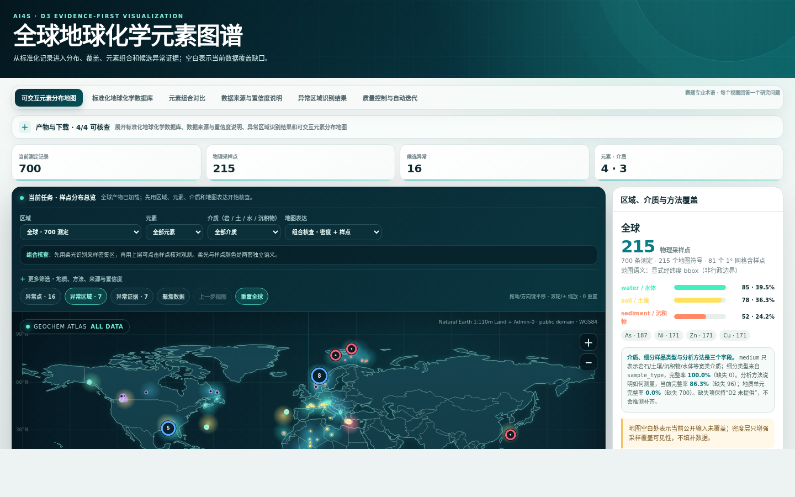
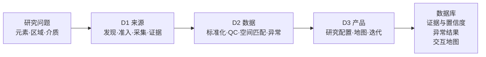

# Global Geochemical Atlas Skill

> 把分散的公开地球化学测定，转化为可追溯的标准数据库、候选异常和交互地图。

**输入：** 岩石、土壤、沉积物与水体中的元素含量、坐标、方法和来源信息<br>
**输出：** 标准化记录 + 证据链 + 置信度 + 富集/亏损候选 + 可交互研究地图

<p align="center">
  
</p>

<p align="center"><sub>真实工作流截图：14 个公开来源的最小复现切片，796 条观测。它验证工程链路，不代表全球空间覆盖。</sub></p>

`Python 3.11+` · `运行时零第三方依赖` · `离线 demo` · `MIT`

这是一个面向 AI Agent 的完整 Skill，而不是一张预制地图。Agent 会按 D1 → D2 → D3 工作流发现和冻结来源，执行单位与坐标质量控制，在可比背景组内筛查异常，再生成可审计的数据库、报告和地图。

## 60 秒运行

```bash
python skills/global-geochemical-atlas/scripts/run_workflow.py \
  --input skills/global-geochemical-atlas/fixtures/demo_input.csv \
  --output-dir demo_output

python skills/global-geochemical-atlas/scripts/validate_outputs.py \
  --output-dir demo_output
```

两个命令应分别返回 `"status": "success"` 和 `"status": "valid"`。随后用浏览器打开 `demo_output/interactive_map.html`；无需网络、密钥、GPU 或 Python 第三方包。

## 你会得到什么

| 赛题交付物 | 运行产物 | 核心保证 |
|---|---|---|
| **可交互元素分布地图** | `interactive_map.html`、`samples.geojson` | 按元素、介质、区域、方法与置信度筛选；查看样点、热力和异常候选 |
| **标准化地球化学数据库** | `geochemistry.csv` | 保留原值与换算轨迹；统一单位、basis、坐标、方法与 QC 字段 |
| **数据来源与置信度说明** | `source_manifest.json`、`record_evidence.jsonl`、`confidence_report.json` | URL/DOI、许可、版本、哈希、源记录定位和五分量置信度可追溯 |
| **异常区域识别结果** | `anomalies.geojson`、`anomaly_report.json` | 在声明的可比背景组内报告富集/亏损方向、样本量、median/MAD 和失败边界 |
| **可复用 Skill 文档** | [`SKILL.md`](skills/global-geochemical-atlas/SKILL.md) | 明确请求契约、工具路由、科学规则、接口和失败状态 |

完整运行固定生成 11 个产物；逐文件 schema 与状态定义见[输入输出契约](skills/global-geochemical-atlas/references/request-output-contract.md)。

## 使用自己的数据

```bash
python skills/global-geochemical-atlas/scripts/run_workflow.py \
  --input /path/to/measurements.csv \
  --output-dir output \
  --region-bbox 73,18,135,54 \
  --max-records 50000
```

D2 最低分析字段是 `element_or_analyte,value,unit,medium`；完整证据工作流还要求 `source_id,source_locator,license`。非标准列名必须通过显式 schema map 映射，不能靠语义猜测。正式科学运行还应提供样品标识、measurement basis、WGS84/原 CRS、分析与消解方法、检出限、来源层级及文件 SHA-256。

## 工作流



- **D1** 保存许可、版本、下载请求、文件哈希和记录级定位；来源目录中的候选不等于本次请求可用。
- **D2** 保守处理单位、删失值、坐标、方法和可选地质匹配；在足够样本的可比组内用稳健 MAD z-score 筛查高/低异常。
- **D3** 只消费公共产物，通过版本化 profile 生成全球、国家或 WGS84 bbox 研究视图；不重算 D2 科学结果。

## 科学护栏

- 原值、原单位、qualifier、来源坐标表达和转换记录始终保留；不能证明的转换会失败关闭。
- 固体质量比可统一为 `mg/kg`，水体质量/体积可统一为 `ug/L`；没有密度时不跨量纲换算。
- `<LOD`、`<LOQ`、`BDL`、`ND` 不替换为 0 或 LOD/2。
- 不静默交换经纬度，不把未知 CRS 冒充 WGS84；空间匹配记录数据源、版本、方法和边界距离。
- 异常只表示相对已声明背景组的筛查候选，不等于污染、矿床或成因结论。
- demo 与真实来源切片只用于工程复现，不支持全球或区域代表性科学结论。

## 复现上图

<details>
<summary>运行 14 来源、四介质、796 条观测的离线样例</summary>

```bash
python skills/global-geochemical-atlas/scripts/build_four_media_demo.py \
  --output-dir /tmp/four-media-demo \
  --generated-at 2026-08-06T10:05:00Z

python skills/global-geochemical-atlas/scripts/run_workflow.py \
  --input /tmp/four-media-demo/demo_input.csv \
  --output-dir /tmp/four-media-output

python skills/global-geochemical-atlas/scripts/validate_outputs.py \
  --output-dir /tmp/four-media-output
```

这些版本化切片来自 GEOROC、USGS、PANGAEA、AfSIS、FOREGS、MarChem、GSJ、GEOTRACES 与 GEMStat 等公开平台。来源适用条件与复现说明见[来源 demo 文档](skills/global-geochemical-atlas/fixtures/source-demos/README.md)。

</details>

## 文档导航

| 如果你想…… | 从这里开始 |
|---|---|
| 让 Agent 执行完整任务 | [Skill 入口](skills/global-geochemical-atlas/SKILL.md) |
| 对接输入或消费 11 个输出 | [请求与输出契约](skills/global-geochemical-atlas/references/request-output-contract.md) |
| 理解数据库字段与专业平台 crosswalk | [数据模型](skills/global-geochemical-atlas/references/data-model.md) |
| 审查单位、删失值、置信度和异常规则 | [科学规则](skills/global-geochemical-atlas/references/scientific-rules.md) |
| 定制全球、区域或元素组合地图 | [D3 可视化契约](skills/global-geochemical-atlas/references/d3-visualization-contract.md) |
| 修改 D1/D2/D3 或提交 PR | [贡献指南](CONTRIBUTING.md) |
| 查看开发期 Q01–Q24 benchmark | [评测说明](evaluation/README.md) |
| 选择正确的测试 Prompt | [测试 Prompt 总入口](TESTING_PROMPTS.md) |

## 开发验证

仓库的测试分层如下。Docker 是统一执行环境，不是第三套 benchmark：

| 入口 | 验证内容 |
|---|---|
| Skill `component_test.py` / `self_test.py` | D1/D2/D3 契约与最小端到端回归 |
| [`evaluation/`](evaluation/) | Q01–Q24、B0/S0、E1 十产物和评分证据 |
| [`evaluation_lyf/`](evaluation_lyf/) | D1/D2/D3 独立科学门禁与 Qwen Skill uplift |
| [`evaluation/docker/`](evaluation/docker/) | 上述评测共用的镜像、隔离、OpenCode 与 campaign runner |

```bash
# D1/D2/D3 公共接口与契约
python skills/global-geochemical-atlas/scripts/component_test.py --component all

# 端到端离线回归
python skills/global-geochemical-atlas/scripts/self_test.py

# evaluation 工具单元测试
python -m unittest discover -s evaluation/tools/tests -v

# Docker 控制器与两份 Qwen Prompt 契约
python -m unittest discover -s evaluation/docker/tests -v
python evaluation_lyf/agent_uplift/test_prompt_contract.py
```

也可以把 `all` 换成 `d1`、`d2` 或 `d3`，单独验证责任域。Docker 的标准构建和 smoke 命令见 [`evaluation/docs/docker_usage.md`](evaluation/docs/docker_usage.md)；两个空目录直接粘贴的有/无 Skill Prompt 见 [`evaluation_lyf/agent_uplift/DOCKER_UPLIFT.md`](evaluation_lyf/agent_uplift/DOCKER_UPLIFT.md)。路径归属、接口变更规则和完成定义见 [`CONTRIBUTING.md`](CONTRIBUTING.md)。

`evaluation/` 和 `evaluation_lyf/` 是开发基准，不是主办方官方题库，也不会进入最终提交包。比赛提交主体只有 `skills/global-geochemical-atlas/` 中这一份 Skill。

## License

代码和原创文档采用 [MIT License](LICENSE)。外部数据仍遵守各自许可、署名和再分发条件；发布结果前请检查运行生成的 `source_manifest.json`。
