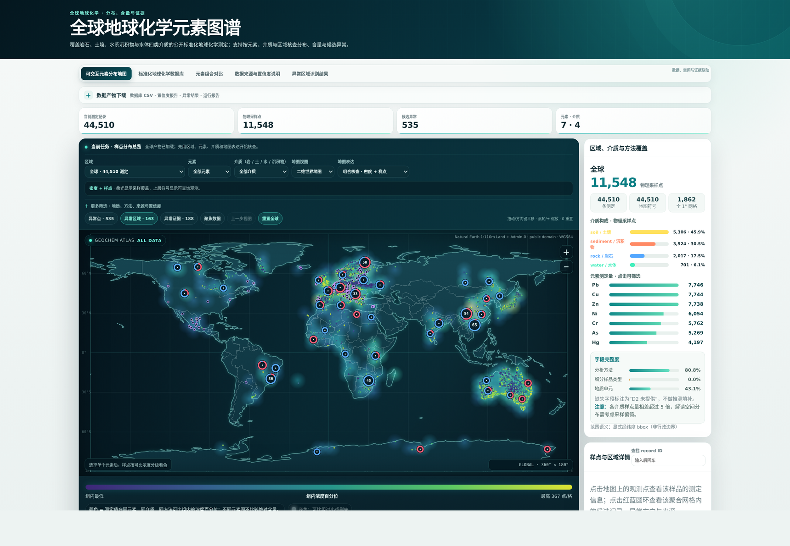
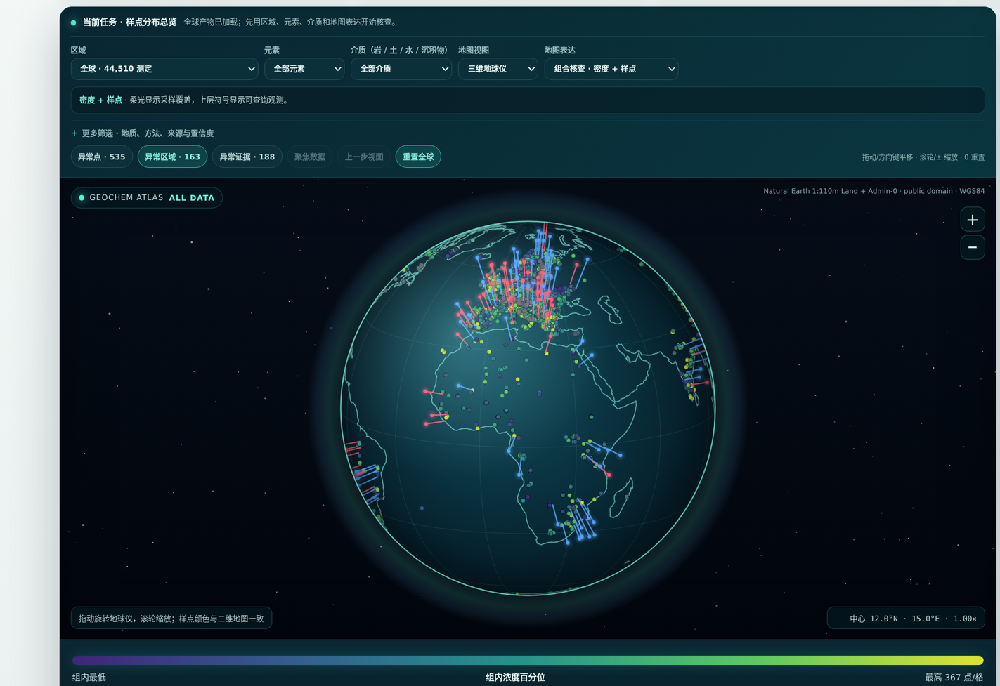

<div align="center">

# 🌍 Global Geochemical Atlas Skill

**全球地球化学元素分布图谱 —— 面向 AI Agent 的可复用科研 Skill**

*Turn scattered public geochemistry into a traceable database, screened anomaly candidates, and self-contained interactive atlases.*

[](https://github.com/asimfish/global-geochemical-atlas-skill/actions/workflows/ci.yml)
[](#-90-秒快速开始)
[](#-90-秒快速开始)
[](#-开发与验证)
[](#-在你的-ai-agent-中使用)
[](LICENSE)

[🌐 在线演示](https://asimfish.github.io/global-geochemical-atlas-demo/) ·
[🚀 快速开始](#-90-秒快速开始) ·
[🤖 在 Agent 中使用](#-在你的-ai-agent-中使用) ·
[🧭 数据来源](#-数据来源22-个已冻结来源) ·
[📦 输出产物](#-十六个输出产物) ·
[❓ FAQ](#-faq)



<sub>真实在线采集运行：15 个公开来源 · 44,510 条测定 · 11,548 个物理采样点 · 7 元素 × 4 介质 · 535 个候选异常（robust-z 筛查候选，非成因结论）。空白区域如实显示数据缺口。<b><a href="https://asimfish.github.io/global-geochemical-atlas-demo/">在线演示与评委讲解页 ↗</a></b></sub>

<br><br>



<sub>同一个自包含 HTML 内置二维世界地图与可拖动旋转的三维地球仪，一键切换；无 CDN、无服务器，断网照常交互。</sub>

</div>

---

## 📌 这是什么

这是一个面向 AI Agent 的**完整科研 Skill**，而不是一张预制地图。给它一个「元素 × 区域 × 介质」请求，Agent 会按 **D1 → D2 → D3** 工作流发现和冻结公开数据源、执行单位与坐标质量控制、在可比背景组内筛查富集/亏损候选，最终产出可审计的标准数据库、证据报告和交互地图。

| 你关心的 | 它给你的 |
|---|---|
| 数据从哪来 | 31 个已冻结、可执行的公开来源与 63 个审计候选（岩石/土壤/沉积物/水体）；正式记录逐条绑定 DOI/URL、版本、许可、定位与文件 SHA-256 |
| 数值和证据能不能用 | 原值永不覆盖、删失值不插补、批次 QC 逐条重算；来源证据/分析就绪度/空间可用性/工作流可用性分开报告 |
| 结论敢不敢用 | 异常只作筛查候选并列出竞争解释；跑不齐的范围诚实报告缺口，绝不冒充全量覆盖 |
| 能不能复用 | 40+ JSON Schema、十六文件产物契约、自包含 HTML 地图、纯标准库脚本，可脱离本仓库对接 |

## 🚀 90 秒快速开始

以下是不需网络、密钥、GPU 或第三方包的**快速回归 demo**，用来确认工程与科学规则可执行；它不是正式图谱研究的默认采集策略。在仓库根目录运行：

```bash
# 1. 运行生产阈值真实数据演示（996 条 hash 固定的 USGS 土壤测定）
python skills/global-geochemical-atlas/scripts/run_atlas_request.py \
  --request skills/global-geochemical-atlas/fixtures/production-usgs/request.json \
  --demo production-usgs \
  --analysis-profile production \
  --generated-at 2026-08-07T00:00:00Z \
  --output-dir /tmp/geochemical-production-demo

# 2. 校验十六文件产物契约
python skills/global-geochemical-atlas/scripts/validate_outputs.py \
  --output-dir /tmp/geochemical-production-demo
```

两个命令应分别返回 `"status": "partial_success"` 和 `"status": "valid"`。前者是**刻意的科学状态**：hash 固定切片完整跑通，但不冒充冻结请求的全量空间覆盖；后者证明十六项产物契约全部有效。

然后用浏览器打开 `/tmp/geochemical-production-demo/interactive_map.html` —— 一个完全自包含、无 CDN 依赖的交互图谱。

<details>
<summary><b>这条回归验证了什么？（点开看预期指标）</b></summary>

- 996/996 条记录完成 GLiM 岩性地质匹配；
- 72 个背景组中 **12 个达到生产阈值 `n≥20` 完成分析，60 个样本不足被诚实排除**（不降阈值、不硬凑）；
- 识别 6 个 high/low 候选异常；
- 输出校验 0 错误 / 0 警告。

它证明工程和科学规则可执行，不代表美国土壤的统计分布。完整证据见[生产演示说明](skills/global-geochemical-atlas/references/production-demo.md)。

</details>

本地重复基准采用 3 次预热和 10 次独立测量，每次都创建新输出目录并验证全部 16 项产物；记录结果与适用边界见[工作流性能基准](skills/global-geochemical-atlas/BENCHMARK.md)。它不是官方模型得分或 2 CPU 容器成绩。

## 🤖 在你的 AI Agent 中使用

本 Skill 按 [Agent Skills](https://agentskills.io) 公共子集编写（`SKILL.md` + `references/` + `scripts/` + `assets/`，一层引用、相对路径、纯标准库），可直接挂载到任何兼容运行时：

```bash
# Claude Code（个人技能目录）
cp -r skills/global-geochemical-atlas ~/.claude/skills/

# Codex CLI
cp -r skills/global-geochemical-atlas ~/.codex/skills/

# OpenCode 及其他兼容运行时：将 skill 目录复制/挂载到其技能目录即可
```

挂载后直接向 Agent 提出诉求即可触发，例如：*「用公开数据做一张西欧土壤砷分布图，标出候选富集区并给出来源和置信度」*。

- 激活边界与示例：[`evals/activation.json`](skills/global-geochemical-atlas/evals/activation.json)（含 4 条应激活/不应激活样例）
- 平台元数据：[`agents/openai.yaml`](skills/global-geochemical-atlas/agents/openai.yaml) · 能力卡片：[`skill-card.md`](skills/global-geochemical-atlas/skill-card.md)
- Agent 的完整执行合同（状态机、门禁、失败状态）：[`SKILL.md`](skills/global-geochemical-atlas/SKILL.md)

## 🧑‍🔬 三种运行方式

### ① 使用自己的数据

```bash
python skills/global-geochemical-atlas/scripts/run_atlas_request.py \
  --request /path/to/request.json \
  --input /path/to/measurements.csv \
  --evidence-jsonl /path/to/record_evidence.jsonl \
  --acquisition-manifest /path/to/run_manifest.json \
  --output-dir /tmp/geochemical-output
```

D2 最低分析字段是 `element_or_analyte,value,unit,medium`；完整证据工作流还要求 `source_id,source_locator,license`。非标准列名必须通过显式 schema map 映射，不能靠语义猜测。正式科学运行还应提供样品标识、measurement basis、WGS84/原 CRS、分析与消解方法、检出限、来源层级及文件 SHA-256。

### ② 在线采集与数据充分性循环（正式研究默认）

```bash
python skills/global-geochemical-atlas/scripts/run_self_correction_loop.py \
  --request /path/to/request.json \
  --online-source auto \
  --cache-dir .cache/data \
  --analysis-profile production \
  --output-dir /tmp/geochemical-online
```

`auto` 先审计哪些平台真正包含请求的元素、介质与区域，再按“新增空间区 × 介质证据 + 独立血缘”顺序在线尝试并验证 manifest/SHA-256。默认研究上限为 12 小时，以 30 分钟为一轮；轮后审计总体、每个元素、每种介质及每个元素 × 介质地图视图，不足且仍有真实扩采空间时继续下一轮。全球使用陆地国家/大区和海洋扇区，国家或 bbox 按范围选择 5° 至 0.25° 网格。缺口写入 `d1_repair_queue.json`，给出范围、维度、候选来源和 fallback chain。时间只是安全停机线，不替代数据充分性门禁；规则由请求和实际观测派生，不按示例国家逐条打补丁，也不靠重复同源空转。

正式研究交付还需通过：

```bash
python skills/global-geochemical-atlas/scripts/validate_research_delivery.py \
  --output-dir /tmp/geochemical-online
```

该门禁要求在线 loop 已收敛、空间/维度队列清空，并校验执行期间及交付时完整 Skill 快照不变；因此 fixture、直接单轮、数据不足检查点、并发混合版本或手工覆盖的 staging 都不能冒充完整研究结果。

### ③ 复现四介质离线样例（21 来源 · 1,144 条观测）

<details>
<summary>运行 21 来源、四介质、1,144 条观测的离线样例</summary>

```bash
python skills/global-geochemical-atlas/scripts/build_four_media_demo.py \
  --output-dir /tmp/four-media-demo \
  --generated-at 2026-08-06T10:05:00Z

python skills/global-geochemical-atlas/scripts/run_workflow.py \
  --input /tmp/four-media-demo/demo_input.csv \
  --output-dir /tmp/four-media-output

python skills/global-geochemical-atlas/scripts/validate_outputs.py \
  --output-dir /tmp/four-media-output
```

这些版本化切片来自 GEOROC、USGS、PANGAEA、AfSIS、FOREGS、MarChem、GSJ、GEOTRACES 与 GEMStat 等公开平台。来源适用条件与复现说明见[来源 demo 文档](skills/global-geochemical-atlas/fixtures/source-demos/README.md)。

</details>

## 🔬 工作流与科学设计


- **D1** 保存许可、版本、下载请求、文件哈希和记录级定位；来源目录中的候选不等于本次请求可用。
- **D2** 保守处理单位、删失值、坐标、方法、实验室批次和可选地质匹配；先用稳健 MAD z-score 筛记录级高/低值，再用精确超几何检验 + BH-FDR 筛空间聚集。
- **D3** 只消费公共产物，通过版本化 profile 生成全球、国家或 WGS84 bbox 研究视图；不重算 D2 科学结果。
- **多轮迭代**：每次运行产出 `iteration_backlog.csv`、`loop_report.json` 和 `d1_repair_queue.json`。每个预算约束轮次后审计一次：通用数量/背景缺口扩采，空间缺口按 `元素 + 介质 + 动态区域` 定向采集，来源/许可/CRS/方法缺口转 D1 准入；每轮生成新版本，canonical 数据与原始证据不在原地改写。

## 📦 十六个输出产物

每次完整运行固定生成 16 个文件，逐文件 schema 与状态定义见[输入输出契约](skills/global-geochemical-atlas/references/request-output-contract.md)：

| 赛题交付物 | 运行产物 | 核心保证 |
|---|---|---|
| **可交互元素分布地图** | `interactive_map.html` · `samples.geojson` | 自包含无 CDN；按元素、介质、区域、方法与工作流可用性筛选；样点、热力与异常候选视图 |
| **标准化地球化学数据库** | `geochemistry.csv` · `batch_acceptance.csv` | 保留原值与换算轨迹；统一单位、basis、坐标、方法、分析批次与 QC 字段 |
| **数据来源与置信度说明** | `sources_and_confidence.json` · `source_manifest.json` · `record_evidence.jsonl` · `confidence_report.json` | URL/DOI、许可、版本、获取时间、哈希、源记录定位；按来源给出测定行/独立样品数，并把来源证据、分析就绪度、空间可用性与工作流可用性分开报告 |
| **异常区域识别结果** | `anomalies.geojson` · `anomaly_report.json` · `anomaly_regions.geojson` · `spatial_anomaly_report.json` | 记录级 robust-MAD 候选 + 精确超几何富集/BH-FDR 空间筛查；完整报告失败边界 |
| **质量与运行证据** | `qc_report.json` · `batch_qc_report.json` · `iteration_backlog.csv` · `run_summary.json` | 逐项 QC 留证、失败批次不静默删除、迭代待办与全运行摘要（含各产物 hash） |

第五项赛题交付「可复用 Skill 文档」即 [`SKILL.md`](skills/global-geochemical-atlas/SKILL.md) 本体与其 schema、脚本和 fixture。

## 🧭 数据来源（31 个已冻结、可执行来源 · 63 个审计候选）

| 介质 | 已冻结来源 |
|---|---|
| 🪨 岩石 | GEOROC（太古宙克拉通汇编 · 南极板内火山岩） |
| 🌱 土壤 | USGS DS801（美国本土）· GEMAS（欧洲）· FOREGS 表土/底土/腐殖质 · AfSIS Phase I（撒哈拉以南非洲）· PANGAEA 北非/巴伦支海沿岸/Amazonas/Batagay · TPDC 中国山地 · EIDC 宁波 |
| 🏞️ 沉积物 | FOREGS 河流/洪泛平原沉积物 · GSJ 日本地球化学图/日本海洋沉积物 · 澳大利亚 NGSA（多元素与 Hg 产品）· 挪威 MarChem · PANGAEA 阿拉伯海/东海/南海 · Zenodo 长江/黄河沉积物（在线适配 + 中国区域 fixture） |
| 💧 水体 | FOREGS 河水 · GEMStat 全球内陆水 · GEOTRACES IDP2025 海水 · 美国 WQP 萨克拉门托河（As） |

31 个 executable source 是已经完成下载、解析与契约实现的来源；63 个 catalog candidate 是完整发现组合，其中仍包括许可、接口、区域或字段证据待核验的候选，不能与正式入库来源相加。每个 executable source 的 DOI、版本、许可、科研使用条件、字段边界与八维证据评分记录在[来源目录](skills/global-geochemical-atlas/references/data-sources.md)、[来源准入标准](skills/global-geochemical-atlas/references/source-acceptance-standard.md)与[许可引用说明](skills/global-geochemical-atlas/references/licenses-and-citations.md)；中国区域 fixture 的登记与重建见[中国区域 fixture](skills/global-geochemical-atlas/references/china-fixture.md)。EarthChem 等联邦检索站作为**发现层**使用：只有追溯到原始记录后才能作测量证据。

## 🛡️ 科学护栏

- 原值、原单位、qualifier、来源坐标表达和转换记录始终保留；不能证明的转换会失败关闭。
- 固体质量比可统一为 `mg/kg`，水体质量/体积可统一为 `ug/L`；`nmol/L` 只对冻结原子量表中的明确元素换算，没有摩尔质量或密度证据时失败关闭。
- `<LOD`、`<LOQ`、`BDL`、`ND` 不替换为 0 或 LOD/2。
- CRM、空白、重复样按显式 policy 重新计算；失败批次保留在数据库，但不进入异常背景。
- 不静默交换经纬度，不把未知 CRS 冒充 WGS84；允许 DOI、字段名、URL 与内容哈希同时匹配的版本化平台坐标政策，空间匹配记录数据源、版本、方法和边界距离。
- 背景组样本不足时诚实返回 `insufficient_background`，绝不降低阈值硬算（上方 demo 中 72 组只分析达标的 12 组）。
- 异常点和 FDR 网格都只表示筛查候选；网格不是地质/行政/污染边界，不等于污染、矿床或成因结论。
- demo 与真实来源切片只用于工程复现，不支持全球或区域代表性科学结论。

## 📚 文档导航

| 如果你想…… | 从这里开始 |
|---|---|
| 在浏览器里体验完整交互图谱与评委讲解页 | [在线演示站](https://asimfish.github.io/global-geochemical-atlas-demo/) |
| 让 Agent 执行完整任务 | [Skill 入口](skills/global-geochemical-atlas/SKILL.md) |
| 为单阶段或完整任务生成最小命令计划 | [任务合同 schema](skills/global-geochemical-atlas/references/task-contract.schema.json) |
| 对接输入或消费 16 个输出 | [请求与输出契约](skills/global-geochemical-atlas/references/request-output-contract.md) |
| 理解数据库字段与专业平台 crosswalk | [数据模型](skills/global-geochemical-atlas/references/data-model.md) |
| 审查单位、删失值、置信度和异常规则 | [科学规则](skills/global-geochemical-atlas/references/scientific-rules.md) |
| 复现真实数据生产阈值闭环 | [生产演示](skills/global-geochemical-atlas/references/production-demo.md) |
| 定制全球、区域或元素组合地图 | [D3 可视化契约](skills/global-geochemical-atlas/references/d3-visualization-contract.md) |
| 做多轮迭代修复 | [迭代闭环协议](skills/global-geochemical-atlas/references/iteration-loop.md) |
| 查看通用空间充分性阈值 | [空间策略 Schema](skills/global-geochemical-atlas/references/spatial-sufficiency-policy.schema.json) |
| 修改 D1/D2/D3 或提交 PR | [贡献指南](CONTRIBUTING.md) |
| 复现离线工作流性能基线 | [性能基准](skills/global-geochemical-atlas/BENCHMARK.md) |

## 🧪 开发与验证

| 入口 | 验证内容 |
|---|---|
| `component_test.py --component all` | D1/D2/D3 公共接口与契约边界（以机器输出为准） |
| `self_test.py` | 科学边界、异常输入与两次运行字节级确定性（75 项检查） |
| `run_self_correction_loop.py --self-test` | 在线扩采、独立样品、尺度自适应及逐筛选视图空间充分性决策（以机器输出为准） |
| `benchmark_workflow.py` | 可重复的离线工作流性能基线 |

```bash
# 全仓格式、lint 与公共契约类型门
ruff check .
ruff format --check .
mypy --config-file mypy-critical.ini

# D1/D2/D3 公共接口与契约
python skills/global-geochemical-atlas/scripts/component_test.py --component all

# 端到端离线回归
python skills/global-geochemical-atlas/scripts/self_test.py

# 多轮数据充分性与停止条件回归
python skills/global-geochemical-atlas/scripts/run_self_correction_loop.py --self-test

# 重复执行并验证完整离线工作流性能
python skills/global-geochemical-atlas/scripts/benchmark_workflow.py \
  --warmups 3 --runs 10 \
  --output /tmp/gga-workflow-benchmark.json
```

也可以把 `all` 换成 `d1`、`d2` 或 `d3`，单独验证责任域。每个脚本都提供稳定的 `--help` 接口；路径归属、接口变更规则和完成定义见 [`CONTRIBUTING.md`](CONTRIBUTING.md)。以上门禁在每个 PR 和 `main` 推送上由 GitHub Actions 自动执行。

## ❓ FAQ

<details>
<summary><b>完全离线能用吗？</b></summary>

能。90 秒 demo、四介质样例和全部测试都基于 hash 固定的本地切片，零网络、零第三方包。但 fixture 只是显式 demo/回归；完整研究入口在未指定 `--input` 或 `--demo` 时默认使用 `--online-source auto`。`offline=true` 只接受已验证缓存或已声明 fixture，不能冒充在线研究。

</details>

<details>
<summary><b>返回 <code>partial_success</code> 是失败吗？</b></summary>

不是。它是刻意设计的科学状态：已验证子集完整跑通并交付，但不冒充冻结请求的全量空间覆盖。缺口、排除原因和下一步建议都写在 `run_summary.json` 里。全部范围与验证通过才会返回 `success`。

</details>

<details>
<summary><b>异常候选可以直接当矿化/污染结论用吗？</b></summary>

不可以。所有异常均为 screening-only 候选：自然背景、采样偏差、空间自相关、方法差异和人为输入都是竞争解释。任何成因解释都需回看原记录与 QC、做尺度敏感性，并取得独立的采样设计、分析质量与地质/矿物学证据。

</details>

<details>
<summary><b>任务时限很长（小时级）时，能自动多轮迭代吗？</b></summary>

能，一条命令启动自我修正循环：

```bash
python skills/global-geochemical-atlas/scripts/run_self_correction_loop.py \
  --request /path/to/request.json \
  --online-source auto \
  --output-dir /tmp/atlas-loop
```

控制器先做早期门禁，每轮独立产出并校验十六文件，再评估元素 × 介质、来源血缘与集中度、在线成功率、测定行/独立样品、溯源、四维可用性、异常背景及各筛选视图的空间广度。空间失败会生成精确修复队列，要求 Agent 尝试已注册候选或留下定向发现证据，不能用其他区域数据掩盖。默认最多 24 个 30 分钟轮次、累计不超过 12 小时；短于一个完整轮次的在线运行必须标记 `--checkpoint-only`。只有队列清空、Skill 快照一致且 `validate_research_delivery.py` 通过才是正式完成。协议详见[迭代闭环](skills/global-geochemical-atlas/references/iteration-loop.md)与[空间覆盖门禁](skills/global-geochemical-atlas/references/global-spatial-coverage.md)。

</details>

<details>
<summary><b>如何新增一个数据源？</b></summary>

按 D1 准入流程：登记来源目录（DOI/版本/许可/科研使用条件）→ 编写来源适配器 → 通过八维证据评分与快照 hash 验证 → 30 条记录具名人工复核后方可进入 `benchmark_ready`。详见[来源准入标准](skills/global-geochemical-atlas/references/source-acceptance-standard.md)与[贡献指南](CONTRIBUTING.md)。

</details>

<details>
<summary><b>为什么坚持零第三方依赖？</b></summary>

评测与生产沙箱环境不可控。纯标准库意味着没有安装失败、没有版本冲突、没有供应链风险；交互地图同样自包含（无 CDN），断网可开。

</details>

## 📄 License

代码和原创文档采用 [MIT License](LICENSE)。外部数据仍遵守各自许可、署名和再分发条件；发布结果前请检查运行生成的 `source_manifest.json`。

<div align="center">
<sub>用公开数据说话，让每个数字可追溯。</sub>
</div>
