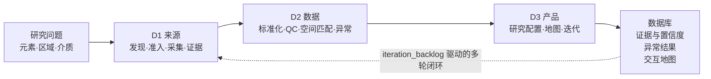

<div align="center">

# 🌍 Global Geochemical Atlas Skill

**全球地球化学元素分布图谱 —— 面向 AI Agent 的可复用科研 Skill**

*把零散的公开地球化学数据，变成可追溯的数据库、经筛查的异常候选与自包含的交互图谱。*

[English](README.md) | **简体中文**

[](https://github.com/asimfish/global-geochemical-atlas-skill/actions/workflows/ci.yml)
[](#-90-秒快速开始)
[](#-90-秒快速开始)
[](#-开发与验证)
[](#-在你的-ai-agent-中使用)
[](#-荣誉与报道)
[](LICENSE)

[🌐 项目主页](https://asimfish.github.io/global-geochemical-atlas-demo/) ·
[🗺️ 在线图谱](https://asimfish.github.io/global-geochemical-atlas-demo/live/world-atlas.html) ·
[🎬 演示视频](https://asimfish.github.io/global-geochemical-atlas-demo/finals/Global-Geochemical-Atlas-Final-Demo.mp4) ·
[🧪 团队官网](https://chembot.zgca.com/)

[🚀 快速开始](#-90-秒快速开始) ·
[🤖 在 Agent 中使用](#-在你的-ai-agent-中使用) ·
[🏗️ 工作原理](#️-工作原理) ·
[🧭 数据来源](#-数据来源22-个已冻结来源) ·
[📦 输出产物](#-十六个输出产物) ·
[❓ FAQ](#-faq)

<a href="https://synmatai.cn/hackathon/"></a>


<sub>2026-08-19 全球在线生产运行界面实拍：全库 <b>199,730</b> 条测定正式入库 · <b>45,753</b> 个独立物理样品 · <b>35</b> 个公开来源 · <b>3,721</b> 个异常筛查候选（robust-z 筛查候选，非成因结论）。空白区域如实显示数据缺口。<b><a href="https://asimfish.github.io/global-geochemical-atlas-demo/">在线演示 ↗</a></b></sub>

<br><br>


<sub>同一个自包含 HTML 内置二维世界地图与可拖动旋转的三维地球仪，一键切换；无 CDN、无服务器，断网照常交互。</sub>

</div>

---

## 📌 这是什么

这是一个面向 AI Agent 的**完整科研 Skill**，而不是一张预制地图。给它一个「元素 × 区域 × 介质」请求，Agent 会按 **D1 → D2 → D3** 工作流发现并冻结公开数据源、执行单位与坐标质量控制、在可比背景组内筛查富集/亏损候选，最终交付可审计的标准数据库、证据报告和交互图谱。

**能力一览**——基于公开文献与开源数据平台，自动采集岩石、土壤、沉积物、水体四介质中的元素含量、采样坐标、地质背景与分析方法信息；完成单位统一、空间匹配、质量控制与来源追溯；支持按元素、区域、地质单元和样品类型生成全球或区域分布图、热力图及元素组合对比；同时识别富集与亏损两类异常候选区域。

| 你关心的 | 它保证的 |
|---|---|
| 数据从哪来 | 22 个已冻结公开来源（岩石/土壤/沉积物/水体），逐记录绑定 DOI、版本、许可与文件 SHA-256 |
| 数值可不可信 | 原值永不覆盖、删失值不插补、批次 QC 逐条重算、五分量置信度并明确声明「不是正确概率」 |
| 结论敢不敢引 | 异常仅作筛查候选并列出竞争解释；跑不齐的范围如实报告缺口，绝不冒充全量覆盖 |
| 能不能复用 | 40+ JSON Schema、十六文件产物契约、自包含 HTML 地图、纯标准库脚本，可脱离本仓库对接 |

最近一次全球在线生产运行（2026-08-19，全程自主）：**199,730** 条确定性入库记录 · **45,753** 个独立物理样品 · **35** 个已接入公开来源（另有 31 个候选经审计后拒绝）· **100%** 记录级来源定位链 · **3,721** 个异常筛查候选 · **393** 条未过标准化门禁的记录如实保留、不静默丢弃。结构化运行证据与逐项解读见[项目主页](https://asimfish.github.io/global-geochemical-atlas-demo/)。

## 🎯 设计承诺

六条承诺定义了这个 Skill。每一条都有实现、有回归测试、有文档——这张表就是索引：

| 承诺 | 保证什么 | 实现与文档 |
|---|---|---|
| **完整的 Loop 机制** | 九个研究步骤、三道门禁；验收不过进入五步修复循环；修不动的缺口标记 `needs_human_review`，绝不粉饰 | [Loop 状态机](#loop-状态机发现问题就回头修修不动就承认) · `run_self_correction_loop.py` |
| **三层 Agent 对抗机制** | 数据入口处侦察提名、质疑挑错、确定性裁判计分；出口处金丝雀校准的审计器把关 | [对抗机制](#对抗机制它可以驱动修复但永远不能自我豁免) · `discovery_duel.py` / `adversarial_audit.py` |
| **每轮评测相对独立** | 评审者在全新线程、跨模型家族运行；跨次记忆只影响第 1 轮调度，运行内证据永远压过记忆——任何一轮都不继承上一轮的结论 | [每一轮保持相对独立](#loop-状态机发现问题就回头修修不动就承认) · `acquisition_memory.py` |
| **SHA-256 数字指纹与结果一一对应** | 哈希锚定四个环节——冻结请求、来源文件、全部 16 个产物、每条可报告断言（`文件 + JSON 指针 + SHA-256`） | [证据链](#证据链每个数字都带指纹) · `claim_ledger.py` |
| **时序演化是图谱内的视图选项** | 时序视图是图谱可视化的选项之一，由同一份标准化数据库驱动——不是独立交付物 | [实测效果](#-实测效果同一套-skill四个分析域) · [时序视图在线演示](https://asimfish.github.io/global-geochemical-atlas-demo/live/world-temporal.html) |
| **Auto-research 真实接入** | 图谱运行通过校验后，用户可选择继续进入研究层——分析队列、环境背景、采样优先级，直至论文初稿 | [图谱之后](#图谱之后可选择继续进入研究模式) · `build_research_products.py` |

## 🚀 90 秒快速开始

只需 Python 3.11+，**无需网络、密钥、GPU 或任何第三方包**。在仓库根目录运行：

```bash
# 1. 运行生产阈值真实数据演示（996 条 hash 固定的 USGS 土壤测定）
python skills/global-geochemical-atlas/scripts/run_atlas_request.py \
  --request skills/global-geochemical-atlas/fixtures/production-usgs/request.json \
  --demo production-usgs \
  --analysis-profile production \
  --generated-at 2026-08-07T00:00:00Z \
  --output-dir /tmp/geochemical-production-demo

# 2. 校验十六文件产物契约
python skills/global-geochemical-atlas/scripts/validate_outputs.py \
  --output-dir /tmp/geochemical-production-demo
```

两个命令应分别返回 `"status": "partial_success"` 与 `"status": "valid"`。前者是**刻意设计的科学状态**：hash 固定切片完整跑通，但不冒充冻结请求的全量空间覆盖；后者证明十六项产物契约全部有效。

### 或者交给指挥官：一条命令跑完全程

```bash
# 冻结请求 → 任务路由 → 修复循环 → 全部校验 → 对抗审计 → 合规报告
python skills/global-geochemical-atlas/scripts/autopilot.py \
  --prompt-file TASK_PROMPT.txt \
  --output-dir /tmp/atlas-run

# 若运行因修复队列停下，恢复也只需一条命令
python skills/global-geochemical-atlas/scripts/autopilot.py \
  --output-dir /tmp/atlas-run --continue
```

`autopilot.py` 把整份 SKILL 合同压成一条确定性命令：把自然语言诉求冻结为 schema 合法的请求（附可审计的 `freeze_report.json`）、完成任务路由、在授权小时级预算时自动调用自纠错循环（`--time-budget-seconds`）、执行全部校验器与对抗审计，最终产出 `executor_compliance_report.json`——其中的 `final_answer_facts` 是最终回复唯一允许引用的数字。终态机器可读：`DONE | CONTINUE_REQUIRED | NEEDS_HUMAN_REVIEW | FAILED`。

然后用浏览器打开 `/tmp/geochemical-production-demo/interactive_map.html`——一个完全自包含、零 CDN 依赖的交互图谱。

<details>
<summary><b>这条回归验证了什么？（点开看预期指标）</b></summary>

- 996/996 条记录完成 GLiM 岩性地质匹配；
- 72 个背景组中 **12 个达到生产阈值 `n≥20` 完成分析，60 个因样本不足被如实排除**（不降阈值、不硬凑）；
- 识别 6 个 high/low 候选异常；
- 输出校验 0 错误 / 0 警告。

它证明工程与科学规则可执行，不代表美国土壤的统计分布。完整证据见[生产演示说明](skills/global-geochemical-atlas/references/production-demo.md)。

</details>

本地重复基准采用 3 次预热与 10 次独立测量，每次都创建新输出目录并验证全部 15 项产物；结果与适用边界见[工作流性能基准](skills/global-geochemical-atlas/BENCHMARK.md)。它不是官方模型得分或 2 CPU 容器成绩。

## 🤖 在你的 AI Agent 中使用

本 Skill 按 [Agent Skills](https://agentskills.io) 公共子集编写（`SKILL.md` + `references/` + `scripts/` + `assets/`，一层引用、相对路径、纯标准库），可直接挂载到任何兼容运行时：

```bash
# Claude Code（个人技能目录）
cp -r skills/global-geochemical-atlas ~/.claude/skills/

# Codex CLI
cp -r skills/global-geochemical-atlas ~/.codex/skills/

# OpenCode 及其他兼容运行时：将 skill 目录复制/挂载到其技能目录即可
```

### 开箱即用的启动 Prompt

挂载后，一句自然语言即可触发。**下面是默认任务 Prompt**——它完整走一遍全流程，你只需替换三个加粗槽位（比如换个地区）就是自己的任务：

> 只基于公开文献与开源数据平台，为**西欧**构建**土壤**中**砷（As）**元素的分布图谱：自动采集元素含量、采样坐标、地质背景与分析方法信息；完成单位统一、空间匹配、质量控制与来源追溯；生成可按元素、区域、地质单元和样品类型筛选的分布图、热力图与元素组合对比；识别候选的异常富集与亏损区域；并交付可交互元素分布地图、标准化地球化学数据库、数据来源与置信度说明及异常区域识别结果。

| 槽位 | 填什么 | 示例 |
|---|---|---|
| **介质** | 支持四种介质中的一种或多种 | `土壤` · `沉积物` · `水体` · `岩石` |
| **元素** | 元素符号或分析物名称 | `砷（As）` · `Cu` · `Pb` · `Hg` |
| **区域** | `global`、命名区域或 WGS84 边界框 | `西欧` · `中国` · `纬度 30–45，经度 –10–30` |

更简短的说法同样能触发：

> 只用公开数据，为**西欧**做一张**土壤砷**分布图谱：统一单位，标出候选富集区域，并为每条记录附上来源、许可与置信度。

> 用公开来源构建**全球沉积物汞**图谱，用 FDR 控制筛查空间聚集异常，并如实报告所有数据缺口。

对接时的常用参考：

- 激活边界与样例：[`evals/activation.json`](skills/global-geochemical-atlas/evals/activation.json)（含 4 条应激活/不应激活样例）
- 平台元数据：[`agents/openai.yaml`](skills/global-geochemical-atlas/agents/openai.yaml) · 能力卡片：[`skill-card.md`](skills/global-geochemical-atlas/skill-card.md)
- Agent 的完整执行合同（状态机、门禁、失败状态）：[`SKILL.md`](skills/global-geochemical-atlas/SKILL.md)

## 🧑‍🔬 三种运行方式

### 方式一：使用自己的数据

```bash
python skills/global-geochemical-atlas/scripts/run_atlas_request.py \
  --request /path/to/request.json \
  --input /path/to/measurements.csv \
  --evidence-jsonl /path/to/record_evidence.jsonl \
  --acquisition-manifest /path/to/run_manifest.json \
  --output-dir /tmp/geochemical-output
```

D2 最低分析字段是 `element_or_analyte,value,unit,medium`；完整证据工作流还要求 `source_id,source_locator,license`。非标准列名必须通过显式 schema map 映射，不能靠语义猜测。正式科学运行还应提供样品标识、measurement basis、WGS84/原 CRS、分析与消解方法、检出限、来源层级及文件 SHA-256。

### 方式二：在线采集公开来源

```bash
python skills/global-geochemical-atlas/scripts/run_atlas_request.py \
  --request /path/to/request.json \
  --online-source auto \
  --cache-dir .cache/data \
  --analysis-profile production \
  --output-dir /tmp/geochemical-online
```

`auto` 会对所有与请求兼容的已路由来源确定性分配记录配额，逐源验证 manifest 与 SHA-256 后合并；单源失败不阻塞整体，以已验证子集继续并返回 `partial_success`。下载均有超时、限量、有限重试与缓存，`--offline` 模式只接受已验证缓存。

### 方式三：复现四介质离线样例（21 来源 · 1,144 条观测）

<details>
<summary>运行 21 来源、四介质、1,144 条观测的离线样例</summary>

```bash
python skills/global-geochemical-atlas/scripts/build_four_media_demo.py \
  --output-dir /tmp/four-media-demo \
  --generated-at 2026-08-06T10:05:00Z

python skills/global-geochemical-atlas/scripts/run_workflow.py \
  --input /tmp/four-media-demo/demo_input.csv \
  --output-dir /tmp/four-media-output

python skills/global-geochemical-atlas/scripts/validate_outputs.py \
  --output-dir /tmp/four-media-output
```

这些版本化切片来自 GEOROC、USGS、PANGAEA、AfSIS、FOREGS、MarChem、GSJ、GEOTRACES 与 GEMStat 等公开平台。来源适用条件与复现说明见[来源 demo 文档](skills/global-geochemical-atlas/fixtures/source-demos/README.md)。

</details>

### 写你自己的 `request.json`

每次运行都由一份冻结请求驱动。从生产 fixture 出发，改几个字段就是你的任务：

```json
{
  "elements": ["As", "Cu", "Ni", "Zn"],
  "region": "global",
  "media": ["soil"],
  "measurement_basis": null,
  "time_range": null,
  "sources": ["usgs-conus-soil"],
  "output_formats": ["csv", "json", "geojson", "html_map"],
  "target_crs": "EPSG:4326",
  "license_policy": "open_only",
  "research_use_policy": "permitted_research",
  "minimum_evidence_tier": "A",
  "minimum_use_mode": "normalized_analysis",
  "max_records": 1000,
  "offline": true
}
```

| 你最可能修改的字段 | 含义 |
|---|---|
| `elements` | 要分析的元素符号，如 `["As"]` 或 `["Cu", "Pb"]` |
| `region` | `"global"`、命名区域或 WGS84 边界框对象 |
| `media` | `soil` / `sediment` / `water` / `rock` 中的一种或多种 |
| `sources` | 固定指定来源 ID；或删除该字段并配合 `--online-source auto` 自动路由 |
| `max_records` | 本次运行的记录上限 |
| `offline` | `true` 只用已验证本地缓存；`false` 允许在线采集 |

逐字段 schema、默认值与状态语义见[请求与输出契约](skills/global-geochemical-atlas/references/request-output-contract.md)。

## 🏗️ 工作原理

「帮我画一张全球土壤砷的分布图谱，并告诉我哪里异常」听上去是个检索任务。放进真实研究团队，它立刻变成四个更难的问题：不同调查、单位与消解方法的数字能不能放进同一张图（**统一指标**）；高值是污染超标还是地质本底（**动态时序**）；几十年前老记录的检出限与坐标系还查得到吗（**质量控制**）；AI 给出的每个数字敢直接引用吗（**来源可回溯**）。这个 Skill 把四类需求统一成一条可信的 Agentic-Native 研究流程。


### 机制总图：模型提案，代码裁决


整条流水线分三段。**输入与准入**：请求以 SHA-256 冻结，来源经许可/版本/哈希审计，逐记录采集并附证据。**确定性处理与验证循环**：mg/kg·WGS84 标准化 → 质量控制 → GLiM 地质匹配 → robust-z 异常筛查 → 产物逐项验证；验证不过进入修复 Loop 重跑比对，经验沉淀进跨次记忆 `memory.json`。**出版审计与模块化交付**：对抗审计先通过植入缺陷的「考试」才能上岗，断言台账拦住一切没有出处的数字。贯穿全程的原则只有一句：**模型负责提案，数值判定一律由确定性代码裁决。**



- **D1** 保存许可、版本、下载请求、文件哈希和记录级定位；来源目录中的候选不等于本次请求可用。
- **D2** 保守处理单位、删失值、坐标、方法、实验室批次与可选地质匹配；先用稳健 MAD z-score 筛记录级高/低值，再用精确超几何检验 + BH-FDR 筛空间聚集。
- **D3** 只消费公共产物，通过版本化 profile 生成全球、国家或 WGS84 bbox 研究视图；从不重算 D2 的科学结果。

### Loop 状态机：发现问题就回头修，修不动就承认


主线是九个研究步骤、三道门（来源准入、单位坐标 QC、逐项验收），一步不跳。第 09 步验收不过时进入修复循环：**列清问题 → 逐条记入 `iteration_backlog` → 按登记的方法对症修 → 重跑再验收 → 沉淀进跨轮记忆库**。每次修复另开新运行、原始证据不可变；修不动的缺口标记 `needs_human_review` 交人处理，绝不硬凑。可直接用 [`run_self_correction_loop.py`](skills/global-geochemical-atlas/scripts/run_self_correction_loop.py) 启动（见 FAQ），或交给 `autopilot.py` 自动调用；完整协议见[迭代闭环参考](skills/global-geochemical-atlas/references/iteration-loop.md)。

**每一轮保持相对独立。**[跨次运行采集记忆](skills/global-geochemical-atlas/references/acquisition-memory.md)（`memory.json`）跨运行累积每个来源的成败账，但它被刻意设计得无力干预评测：记忆**只重排**技能已经路由的来源、永不新增；种子只影响第 1 轮调度，后续轮次的优先级全部由本次运行自己的修复动作推导；记忆文件是**运行输入**而非 Skill 代码——可审计、可删除、可重建。运行内的证据永远压过运行间的记忆，任何一轮都不会继承上一轮的结论。

### 对抗机制：它可以驱动修复，但永远不能自我豁免

两层对抗分别把守数据的入口与出口。

**入口——来源发现对决。**新数据源入库前要过三个角色（[对决协议](skills/global-geochemical-atlas/references/discovery-duel.md)）：


**侦察员**（模型）面向空白区域提名候选来源——只提名，不审批；**质疑员**（独立模型）逐条检查许可、介质、区域——只提问题，不打分、不决定；**裁判**是确定性代码（`discovery_duel.py`），不产生任何意见，只执行明文计分牌：**≥7 分**放行起草接入 spec，**4–6 分**打回重报，**<4 分**出局。评分通过也只取得起草资格，正式入库仍须具名负责人终审。

**出口——对抗性产物审计。**每次运行结束后，[`adversarial_audit.py`](skills/global-geochemical-atlas/scripts/adversarial_audit.py) 必须先证明自己称职才有资格裁决（[协议](skills/global-geochemical-atlas/references/adversarial-audit.md)）：它先把产物复制成影子副本，按种子确定性植入 **10 类已知缺陷**（数值篡改、单位翻转、删失填补、伪造来源、证据孤儿、哈希损坏、定位越界、URL 掉包、坐标交换、异常 z 值篡改），先审影子副本这场「考试」。只有**全部抓到（recall = 1.0）**，它对真实产物的裁决才可采信；有漏网则自动降级为 `inadmissible_calibration_failed`，不允许出具 PASS。裁决分三级——`pass` / `pass_scope_narrowed` / `fail`——warning 不杀稿，而是强制收窄引用口径：受影响数字只能连同范围句一起出现。

**审计独立性靠契约保证，不靠信任。**双 Agent 模式下，审计简报携带机读 `reviewer_contract`：质疑员必须来自与执行者**不同的模型家族**，必须在**全新线程**中工作（无共享记忆、不接收 Builder 的任何叙述）、只读产物字节、先通过同一场金丝雀考试，且当简报中任何路径或 SHA-256 校验不符时**必须拒审**。已确认的发现回流修复队列、驱动下一轮循环——对抗结果推动流水线前进，而不是停在报告里。

### 证据链：每个数字都带指纹

信任在四个环节锚定 SHA-256，让结果与证据一一对应：

1. **请求冻结**——任务本身在执行前先被哈希，中途目标漂移可被发现；
2. **来源文件**——每个下载文件入库前都要通过记录在案的哈希校验；
3. **产物**——`run_summary.json` 记录 16 个产物各自的哈希，评审契约在哈希不符时直接拒审；
4. **断言**——[`claim_ledger.py`](skills/global-geochemical-atlas/scripts/claim_ledger.py) 从产物推导全部可报告断言，每条绑定「文件 + JSON 指针 + SHA-256」证据指针，且每次调用都从证据重新计算——执行者可以构建台账，但永远改写不了完整性判定。回复草稿再经 `--check-answer` 交叉核对：追溯不到台账的承重数字判为幻数（phantom），引用了收窄口径的断言却缺范围关键词判为越界。

### 图谱之后：可选择继续进入研究模式

图谱是检查点，不是终点。在任何一次**已完成并通过校验**的运行之上，一条命令即可叠加可选的研究后处理层（[research mode 契约](skills/global-geochemical-atlas/references/research-mode.md)）：

```bash
python skills/global-geochemical-atlas/scripts/build_research_products.py \
  --output-dir /tmp/atlas-run \
  --research-dir /tmp/atlas-run/research \
  --minimum-confidence medium
```

它不采集新数据、不修改任何核心产物，只把已有证据确定性地重组为三类研究者产品——**分析队列**（`analysis_cohorts.csv`：哪些记录可以相互比较、哪些不能、为什么）、**环境背景**（`research_context.csv`：逐样品的岩性、地质单元、沉积环境、深度、粒级与采样时间）、**采样优先级**（`sampling_priority.geojson`：把数据缺口排序成下一批采集队列）——外加一份 model-card 式收据（`research_products_receipt.json`，含输入哈希、参数与不可宣称事项）。同样的续跑在冻结快照上走得更远，就是下文[五篇论文初稿](#-从图谱到论文科学发现层)的来源。

## 📦 十六个输出产物

每次完整运行固定生成 16 个文件，逐文件 schema 与状态定义见[请求与输出契约](skills/global-geochemical-atlas/references/request-output-contract.md)：

| 交付类别 | 运行产物 | 核心保证 |
|---|---|---|
| **可交互元素分布地图** | `interactive_map.html` · `samples.geojson` | 自包含零 CDN；按元素、介质、区域、地质单元、样品类型、方法与置信度筛选；样点、热力图、元素组合对比与异常候选视图 |
| **标准化地球化学数据库** | `geochemistry.csv` · `batch_acceptance.csv` | 保留原值与换算轨迹；统一单位、basis、坐标、方法、分析批次与 QC 字段 |
| **数据来源与置信度说明** | `source_manifest.json` · `record_evidence.jsonl` · `confidence_report.json` · `sources_and_confidence.json` | URL/DOI、许可、版本、哈希、源记录定位与五分量置信度全程可追溯，另附面向读者的合并摘要 |
| **异常区域识别结果** | `anomalies.geojson` · `anomaly_report.json` · `anomaly_regions.geojson` · `spatial_anomaly_report.json` | 记录级 robust-MAD 候选 + 精确超几何/BH-FDR 空间筛查，覆盖富集与亏损两向；失败边界完整报告 |
| **质量与运行证据** | `qc_report.json` · `batch_qc_report.json` · `iteration_backlog.csv` · `run_summary.json` | 逐项 QC 留证、失败批次绝不静默删除、迭代待办与全运行摘要（含各产物哈希） |

第五类交付「可复用 Skill 文档」即 [`SKILL.md`](skills/global-geochemical-atlas/SKILL.md) 本体及其 schema、脚本与 fixture。选择[继续进入研究模式](#图谱之后可选择继续进入研究模式)时，会在独立的 `research/` 目录追加 `analysis_cohorts.csv`、`research_context.csv`、`sampling_priority.geojson` 与收据，不触碰核心契约。

## 🧭 数据来源（22 个已冻结来源）

| 介质 | 已冻结来源 |
|---|---|
| 🪨 岩石 | GEOROC（太古宙克拉通汇编 · 南极板内火山岩） |
| 🌱 土壤 | USGS DS801（美国本土）· GEMAS（欧洲）· FOREGS 表土/底土/腐殖质 · AfSIS Phase I（撒哈拉以南非洲）· PANGAEA 北非 · TPDC 中国山地 |
| 🏞️ 沉积物 | FOREGS 河流/洪泛平原沉积物 · GSJ 日本地球化学图 · GSJ 日本海洋沉积物 · 澳大利亚 NGSA（Hg）· 挪威 MarChem · PANGAEA 阿拉伯海 · Zenodo 长江/黄河沉积物（中国区域 fixture） |
| 💧 水体 | FOREGS 河水 · GEMStat 全球内陆水 · GEOTRACES IDP2025 海水 · 美国 WQP 萨克拉门托河（As） |

每个来源的 DOI、版本、许可、科研使用条件、字段边界与八维证据评分记录在[来源目录](skills/global-geochemical-atlas/references/data-sources.md)、[来源准入标准](skills/global-geochemical-atlas/references/source-acceptance-standard.md)与[许可引用说明](skills/global-geochemical-atlas/references/licenses-and-citations.md)；中国区域双源 fixture（TPDC 全量 + Zenodo 7098563）的登记与重建见[中国区域 fixture](skills/global-geochemical-atlas/references/china-fixture.md)。EarthChem 等联邦检索站仅作**发现层**：只有追溯到原始记录后才能作为测量证据。

## 🛡️ 科学护栏

- 原值、原单位、qualifier、来源坐标表达与转换记录始终保留；不能证明的转换一律失败关闭。
- 固体质量比可统一为 `mg/kg`，水体质量/体积可统一为 `ug/L`；`nmol/L` 只对冻结原子量表中的明确元素换算，缺少摩尔质量或密度证据时失败关闭。
- `<LOD`、`<LOQ`、`BDL`、`ND` 不替换为 0 或 LOD/2。
- CRM、空白、重复样按显式 policy 重算；失败批次保留在数据库，但不进入异常背景。
- 不静默交换经纬度，不把未知 CRS 冒充 WGS84；版本化平台坐标政策要求 DOI、字段名、URL 与内容哈希同时匹配，空间匹配记录数据源、版本、方法与边界距离。
- 背景组样本不足时如实返回 `insufficient_background`，绝不降阈值硬算（上方 demo 中 72 组只分析达标的 12 组）。
- 异常点与 FDR 网格均只表示筛查候选；网格不是地质/行政/污染边界，不等于污染、矿床或成因结论。
- demo 与真实来源切片只用于工程复现，不支持全球或区域代表性的科学结论。

## 🧾 三重真实运行验证

除仓库内的离线回归外，本 Skill 经过三组相互独立的真实运行检验，覆盖不同风险面（证据文件均可在[项目主页](https://asimfish.github.io/global-geochemical-atlas-demo/)核查）：

| 运行 | 验证内容 | 关键结果 |
|---|---|---|
| 全球在线生产运行（2026-08-15） | 真实网络条件下的自主采集、失败处置与缺口报告 | 33 分钟全自主：63 个来源候选审计 → 31 正式接入 → 29 实际入库；两个 GEOROC 端点持续 HTTP 500，如实记录；238 项待修复项全部登记进修复队列 |
| 确定性回归（`main@ed8249e`） | 全新克隆环境中产物能否逐字节复现 | 0.714 秒完成回归：996/996 条地质匹配、6 个异常候选逐字节一致；hash-bound 快照防止跨环境漂移 |
| 对抗审计（2026-08-20） | 红队向产物影子副本植入 10 类缺陷（数值篡改、单位翻转、伪造声明等），校准审计层检出能力 | 10/10 全部捕获；幻觉数字「25000」被判 `answer_unbound`——没有证据绑定的数字不允许出场 |

三组结果各自独立口径，不作混合统计。证据入口：[`run_summary.json`](https://asimfish.github.io/global-geochemical-atlas-demo/finals/real-run/run_summary.json) · [`audit_receipt.json`](https://asimfish.github.io/global-geochemical-atlas-demo/finals/audit-run/audit_receipt.json) · [`claim_ledger.json`](https://asimfish.github.io/global-geochemical-atlas-demo/finals/audit-run/claim_ledger.json)。

## 🌏 实测效果：同一套 Skill，四个分析域


同一套方法在四个地区真实运行，不改一行代码：**世界** 198,445 条可显示测定 / 3,446 条待复核异常；**中国** 24,536 条 / 740 条异常 / 78 个集中区域；**欧洲** 47,459 条 / 981 条；**美国** 91,458 条 / 1,398 条。各地区按各自范围统计，不能与全球总数直接相加或对比。每张图都是自包含 HTML，可在线打开逐项核查：

[世界图谱](https://asimfish.github.io/global-geochemical-atlas-demo/live/world-atlas.html) ·
[中国图谱](https://asimfish.github.io/global-geochemical-atlas-demo/live/china-atlas.html) ·
[欧洲图谱](https://asimfish.github.io/global-geochemical-atlas-demo/live/europe-atlas.html) ·
[美国图谱](https://asimfish.github.io/global-geochemical-atlas-demo/live/us-atlas.html) ·
[时序演化图谱（1986–2024）](https://asimfish.github.io/global-geochemical-atlas-demo/live/world-temporal.html)

其中**时序演化视图**是图谱可视化的选项之一，而非独立交付物：它由同一份标准化数据库驱动，当记录具备可靠采样时间时，联合方法分层、地质背景、剖面对照与多期观测，把「高值是地质富集，还是工业活动」变成可检验的问题——把稳定的地质高背景与随工业活动变化的人为富集信号分开检验。

## 🔭 从图谱到论文：科学发现层


图谱不是终点。discovery_mode 在同一份冻结快照（191,715 条 / 29 源）上走完整条流水线：**图谱扫描发现现象 → 31 个候选选题按证据挑选 → 小样本试点验证（站不住的题当场停掉）→ 复现闸门与文献核对 → 多角色接力成稿 → 独立审稿并把缺口回灌采集队列**。已完整跑通五次，成稿 5 篇论文初稿（46 页 · 24 图 · 9 表），每个数字均可由快照 + 固定种子脚本确定性重放：

1. [欧洲土壤剖面 Hg/Pb 遗留富集的方法分层筛查](https://asimfish.github.io/global-geochemical-atlas-demo/research/P1-comparability-aware-screening-europe.pdf)
2. [表层遗留富集并非全球常态：澳大利亚土壤的检验](https://asimfish.github.io/global-geochemical-atlas-demo/research/P2-hemispheric-contrast-australia.pdf)
3. [同一份土样、两种方法可差三倍：跨方法偏移的量化与换算](https://asimfish.github.io/global-geochemical-atlas-demo/research/P3-method-transfer-models.pdf)
4. [两个独立调查是否一致：全球砷图的地面验证](https://asimfish.github.io/global-geochemical-atlas-demo/research/P4-arsenic-validation.pdf)
5. [零调参能否恢复已知海洋学结构：GEOTRACES 剖面提取与方法审计](https://asimfish.github.io/global-geochemical-atlas-demo/research/P5-geotraces-audit.pdf)

五篇均为筛查级（screening-level）结论：富集 ≠ 污染定论，剖面形态 ≠ 机制证明，正式投稿前需领域专家复核。路线图见[五篇论文规划](https://asimfish.github.io/global-geochemical-atlas-demo/research/five-paper-roadmap.md)。

## 📊 与同类数据库的定位


诚实前提：不与机构级规模竞争。GEOROC / EarthChem / NGDB 强在体量与存档，专题调查库强在库内一致性；GGA 补的是它们之间缺失的**统一数据层**——四介质一表、逐行 lineage 与 SHA-256、记录级许可与四维置信度、缺口以机器可读采集队列输出。本节引用的外部数字均已核对官方页面（查阅日期 2026-08-20），逐项出处见 [database-comparison.md](https://asimfish.github.io/global-geochemical-atlas-demo/research/database-comparison.md)。

## 📚 文档导航

| 如果你想…… | 从这里开始 |
|---|---|
| 在浏览器里体验完整交互图谱 | [项目主页](https://asimfish.github.io/global-geochemical-atlas-demo/) |
| 让 Agent 执行完整任务 | [Skill 入口](skills/global-geochemical-atlas/SKILL.md) |
| 为单阶段或完整任务生成最小命令计划 | [任务合同 schema](skills/global-geochemical-atlas/references/task-contract.schema.json) |
| 对接输入或消费 16 个输出 | [请求与输出契约](skills/global-geochemical-atlas/references/request-output-contract.md) |
| 理解数据库字段与专业平台 crosswalk | [数据模型](skills/global-geochemical-atlas/references/data-model.md) |
| 审查单位、删失值、置信度和异常规则 | [科学规则](skills/global-geochemical-atlas/references/scientific-rules.md) |
| 复现真实数据生产阈值闭环 | [生产演示](skills/global-geochemical-atlas/references/production-demo.md) |
| 定制全球、区域或元素组合地图 | [D3 可视化契约](skills/global-geochemical-atlas/references/d3-visualization-contract.md) |
| 做多轮迭代修复 | [迭代闭环协议](skills/global-geochemical-atlas/references/iteration-loop.md) |
| 修改 D1/D2/D3 或提交 PR | [贡献指南](CONTRIBUTING.md) |
| 复现离线工作流性能基线 | [性能基准](skills/global-geochemical-atlas/BENCHMARK.md) |

## 🧪 开发与验证

| 入口 | 验证内容 |
|---|---|
| `component_test.py --component all` | D1/D2/D3 公共接口与契约边界（394 项检查） |
| `component_test_more.py` | autopilot、对抗审计、断言台账、跨次记忆、来源对决与声明式适配器（60 项检查） |
| `self_test.py` | 科学边界、异常输入与两次运行字节级确定性（75 项检查） |
| `benchmark_workflow.py` | 可重复的离线工作流性能基线 |

```bash
# 全仓格式、lint 与公共契约类型门
ruff check .
ruff format --check .
mypy --config-file mypy-critical.ini

# D1/D2/D3 公共接口与契约
python skills/global-geochemical-atlas/scripts/component_test.py --component all

# 端到端离线回归
python skills/global-geochemical-atlas/scripts/self_test.py

# 重复执行并验证完整离线工作流性能
python skills/global-geochemical-atlas/scripts/benchmark_workflow.py \
  --warmups 3 --runs 10 \
  --output /tmp/gga-workflow-benchmark.json
```

可把 `all` 换成 `d1`、`d2` 或 `d3` 单独验证责任域。每个脚本都提供稳定的 `--help`；路径归属、接口变更规则与完成定义见 [`CONTRIBUTING.md`](CONTRIBUTING.md)。以上门禁在每个 PR 和 `main` 推送上由 GitHub Actions 自动执行。

## ❓ FAQ

<details>
<summary><b>完全离线能用吗？</b></summary>

能。90 秒 demo、四介质样例与全部测试都基于 hash 固定的本地切片，零网络、零第三方包。在线采集只在显式传入 `--online-source` 时发生，且 `--offline` 模式只接受已验证缓存。

</details>

<details>
<summary><b>返回 <code>partial_success</code> 是失败吗？</b></summary>

不是。它是刻意设计的科学状态：已验证子集完整跑通并交付，但不冒充冻结请求的全量空间覆盖。缺口、排除原因与下一步建议都写在 `run_summary.json` 里。只有全部范围通过验证才返回 `success`。

</details>

<details>
<summary><b>异常候选可以直接当矿化/污染结论用吗？</b></summary>

不可以。所有异常均为 screening-only 候选：自然背景、采样偏差、空间自相关、方法差异与人为输入都是竞争解释。任何成因解释都需回看原记录与 QC、做尺度敏感性分析，并取得采样设计、分析质量与地质/矿物学的独立证据。

</details>

<details>
<summary><b>任务时限很长（小时级）时，能自动多轮迭代吗？</b></summary>

能，一条命令启动自我修正循环：

```bash
python skills/global-geochemical-atlas/scripts/run_self_correction_loop.py \
  --request /path/to/request.json \
  --online-source auto \
  --max-rounds 5 \
  --output-dir /tmp/atlas-loop
```

控制器先做早期门禁（路由可行性、最低输入列），每轮独立产出并校验十六文件契约，自动重试瞬态获取失败，把 schema/许可/坐标等需要证据的问题分组写入 `loop_report.json` 的修复计划；收敛、无进展或预算用尽时诚实停机。人工修复后在同一目录重新调用即可续跑。canonical 数据不可变，每轮生成新版本；删失值等 `scientific_limit` 不计入修复率——科学限制不能靠循环「修」掉。协议详见[迭代闭环](skills/global-geochemical-atlas/references/iteration-loop.md)。

</details>

<details>
<summary><b>如何新增一个数据源？</b></summary>

按 D1 准入流程：登记来源目录（DOI/版本/许可/科研使用条件）→ 编写来源适配器 → 通过八维证据评分与快照 hash 验证 → 30 条记录具名人工复核后方可进入 `benchmark_ready`。详见[来源准入标准](skills/global-geochemical-atlas/references/source-acceptance-standard.md)与[贡献指南](CONTRIBUTING.md)。

</details>

<details>
<summary><b>为什么坚持零第三方依赖？</b></summary>

评测与生产沙箱环境不可控。纯标准库意味着没有安装失败、没有版本冲突、没有供应链风险；交互地图同样自包含（无 CDN），断网可开。

</details>

## 🏆 荣誉与报道

- 🏆 **[新研智材 SynMatAI · AI4S Future ScienceSkills Hackathon](https://synmatai.cn/hackathon/) 冠军**（词元代理人队）
- 🎬 [主讲幻灯片](https://asimfish.github.io/global-geochemical-atlas-demo/slides.html)（22 页 HTML，含完整机制讲解与实测结果）· [海报 PDF](https://asimfish.github.io/global-geochemical-atlas-demo/finals/Global-Geochemical-Atlas-Poster.pdf)
- 📕 [小红书项目介绍](https://xhslink.cn/o/7EMuFyOOsO5) · 📘 [知乎专栏文章](https://zhuanlan.zhihu.com/p/2073539526404879853)

## 👥 团队

**词元代理人队** —— 五名博士生，覆盖机器学习、具身智能、三维重建与实验室自动化：

| 成员 | 单位 | 方向 |
|---|---|---|
| 李雨峰 | 上海交通大学 | 图机器学习、具身智能与最优传输理论（师从严骏驰教授） |
| 王培朔 | 上海交通大学 | 视觉-语言-动作（VLA）模型与化学实验室自动化（师从吴帆教授） |
| 郭欣睿 | 北京航空航天大学 | 人工智能；材料与 AI 交叉背景 |
| 白丰硕 | 上海交通大学 | PAIR-Lab；师从杨耀东、温颖两位教授 |
| 李明伟 | 浙江大学 | 三维（3D）与四维（4D）场景重建及生成式模型 |

<div align="center">

</div>

团队主页：[chembot.zgca.com](https://chembot.zgca.com/)

## 🤝 贡献

欢迎 Issue 与 PR。修改 D1/D2/D3、新增数据源或调整契约前，请先阅读[贡献指南](CONTRIBUTING.md)（路径归属、接口变更规则、完成定义）与[架构文档](ARCHITECTURE.md)；所有 PR 须通过 CI 的 lint、类型与 469 项测试门禁。

## 📄 License 与引用

代码与原创文档采用 [MIT License](LICENSE)。外部数据仍遵守各自许可、署名与再分发条件；发布结果前请检查运行生成的 `source_manifest.json`。

如果本项目对你的研究或工程有帮助，欢迎引用：

```bibtex
@software{gga_skill_2026,
  author = {Li, Yufeng and Wang, Peishuo and Guo, Xinrui and Bai, Fengshuo and Li, Mingwei},
  title  = {Global Geochemical Atlas Skill: A Reusable Research Skill for AI Agents},
  year   = {2026},
  url    = {https://github.com/asimfish/global-geochemical-atlas-skill}
}
```

<div align="center">
<sub>用公开数据说话，让每个数字可追溯。</sub>
</div>
